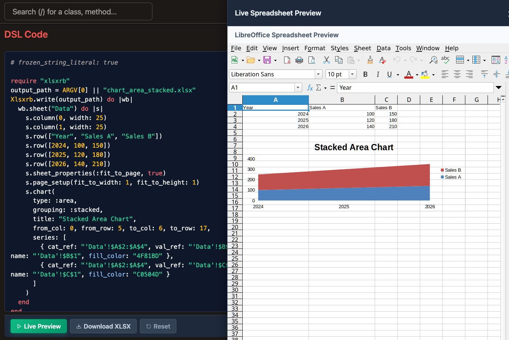
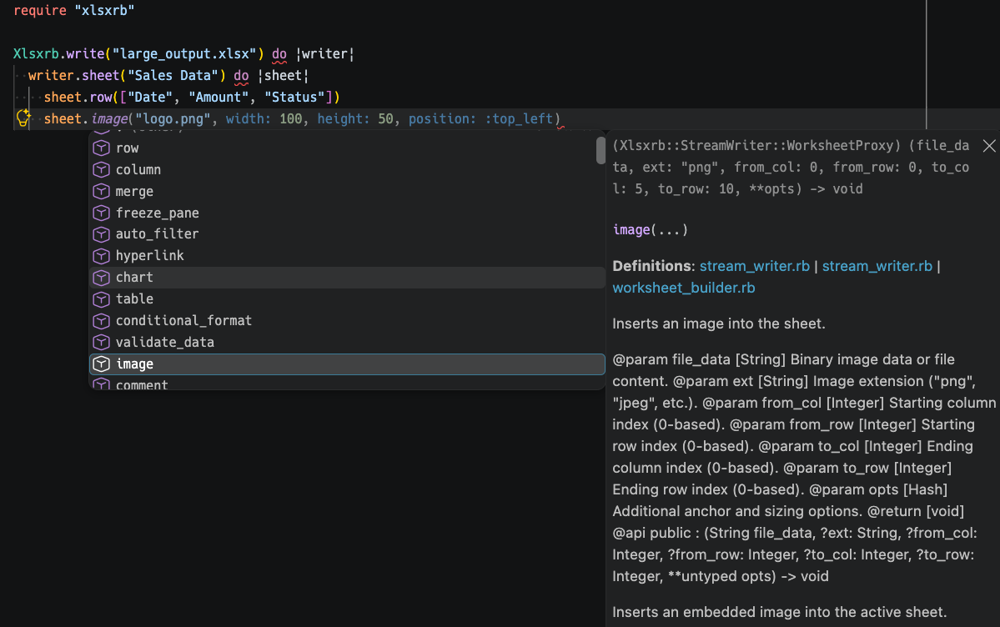
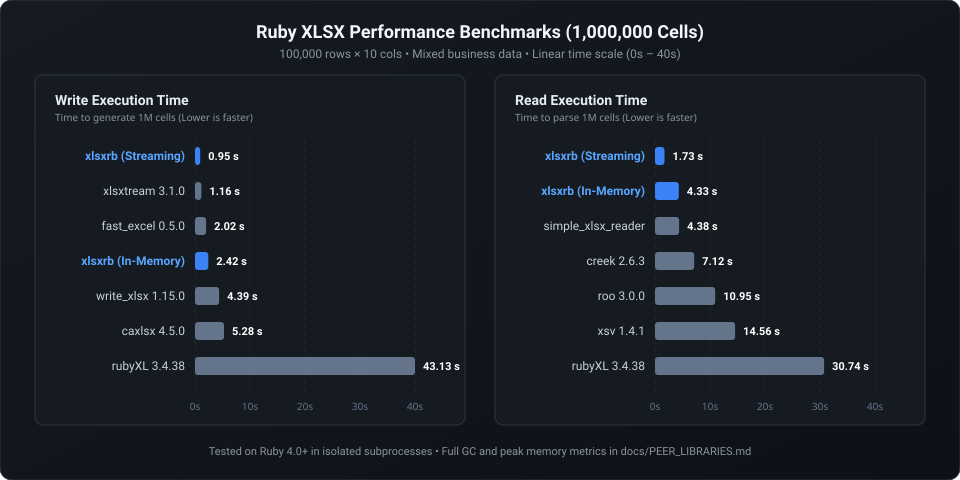

# Xlsxrb

A Ruby library for reading and writing XLSX files with streaming support.

## Motivation

The Ruby ecosystem already has great XLSX libraries, each designed for specific tradeoffs:

| Library | Read | Write | Streaming | In-Memory |
| :--- | :---: | :---: | :---: | :---: |
| [roo](https://rubygems.org/gems/roo) | ✅ | ❌ | ✅ | ❌ |
| [creek](https://rubygems.org/gems/creek) | ✅ | ❌ | ✅ | ❌ |
| [xsv](https://rubygems.org/gems/xsv) | ✅ | ❌ | ✅ | ❌ |
| [simple_xlsx_reader](https://rubygems.org/gems/simple_xlsx_reader) | ✅ | ❌ | ✅ | ❌ |
| [caxlsx / axlsx](https://rubygems.org/gems/caxlsx) | ❌ | ✅ | ❌ | ✅ |
| [write_xlsx](https://rubygems.org/gems/write_xlsx) | ❌ | ✅ | ❌ | ✅ |
| [xlsxtream](https://rubygems.org/gems/xlsxtream) | ❌ | ✅ | ✅ | ❌ |
| [fast_excel](https://rubygems.org/gems/fast_excel) | ❌ | ✅ | ✅ | ❌ |
| [rubyXL](https://rubygems.org/gems/rubyXL) | ✅ | ✅ | ❌ | ✅ |
| **[xlsxrb](https://github.com/niku/xlsxrb)** | **✅** | **✅** | **✅** | **✅** |

Each of these libraries makes deliberate architectural choices:
* **Streaming Model**: Writes or reads rows sequentially on-the-fly to maintain a constant $O(1)$, low-memory footprint regardless of dataset size.
* **In-Memory Model**: Builds a complete document object model, offering flexible random access, cell updates, and document templates at the cost of memory usage on large spreadsheets.

Traditionally, maintaining an all-in-one gem that offers both reading and writing across both streaming and in-memory models, alongside rich OOXML features, high performance, and strict compatibility, presents an inherent open-source challenge: the cumulative maintenance overhead often exceeds the capacity of individual human maintainers.

`xlsxrb` is built on a modern premise: **Advanced Agentic AI (AI Coders) can sustainably handle this maintenance demand.** By utilizing AI agents to automate end-to-end testing, visual regression testing, specification compliance verification, and documentation updates, `xlsxrb` delivers a fast, specification-compliant, and fully-featured XLSX library built for long-term sustainability.

### Design Principles

- **Minimal Dependencies**: Zero core logic dependencies. Built purely on the Ruby standard library and bundled gems (`zlib`, `rexml`, etc.). The only runtime dependency is `opentelemetry-api` (zero-overhead no-op when unconfigured).
- **Streaming Support**: True $O(1)$ constant memory streaming for both reading and writing massive spreadsheets.
- **Strict OpenXML Interoperability**: Fully compliant with ISO/IEC 29500 (ECMA-376) and validated continuously against the official Microsoft [Open XML SDK](https://github.com/dotnet/Open-XML-SDK).
- **AI-Assisted Sustainability**: Leveraging AI coding agents for automated quality assurance, E2E validation, and continuous feature expansion.
- **Modern Ruby**: Built for Ruby 4.0 or higher.

## Installation

```bash
bundle add xlsxrb
# Or without Bundler: gem install xlsxrb
```

## Interactive Playground (WebAssembly)

Try `xlsxrb` directly in your browser without installing anything!

[👉 Try the Live Demo / Interactive Playground](https://niku.github.io/xlsxrb/docs/visual/VisualGallery_md.html)

<p align="center">
  
</p>

You can also browse 50+ rendered visual examples across all features in the [Visual Examples Gallery](docs/visual/VisualGallery.md).

## Usage

### Quick Start: Streaming (Recommended for Large Files)

#### Streaming Write ($O(1)$ Memory)
```ruby
require "xlsxrb"

Xlsxrb.write("large_output.xlsx") do |writer|
  writer.sheet("Sales Data") do |sheet|
    sheet.row(["Date", "Amount", "Status"])
    sheet.row([Date.today, 100, true])
    sheet.column(0, width: 15.5)
  end
end
```

#### Streaming Read ($O(1)$ Memory)
```ruby
require "xlsxrb"

Xlsxrb.read("large_file.xlsx") do |sheet|
  sheet.each_row do |row|
    row.each_cell do |cell|
      puts "#{cell.ref}: #{cell.value}"
    end
  end
end
```

### In-Memory Building & Modifying

#### Creating & Exporting (Rails / Mailers)
```ruby
require "xlsxrb"

wb = Xlsxrb.build do |b|
  b.sheet("Report") do |s|
    s.row(["Metric", "Value"])
    s.row(["Users", 1000])
  end
end

# Save to file or get binary string for Rails send_data
Xlsxrb.write("report.xlsx", wb)
binary_data = Xlsxrb.write(wb)
```

#### Modifying an Existing File
```ruby
require "xlsxrb"

Xlsxrb.modify("template.xlsx", "output.xlsx") do |workbook|
  workbook.update_sheet("Invoice") do |sheet|
    sheet.update_cell("C4", value: "INV-10042")
         .update_cell("C5", value: Date.today)
  end
end
```

### Password Protection & Encryption ([MS-OFFCRYPTO])

Natively supports reading and writing encrypted XLSX files (Standard & Agile Encryption) with zero external C-extensions:

```ruby
require "xlsxrb"

# Write password-protected file
Xlsxrb.write("confidential.xlsx", password: "SecretPassword123") do |writer|
  writer.sheet("Financials") { |sheet| sheet.row(["Assets", 5_000_000]) }
end

# Read password-protected file
Xlsxrb.read("confidential.xlsx", password: "SecretPassword123") do |sheet|
  sheet.each_row { |row| puts row.cells.map(&:value) }
end
```

### IDE Autocompletion & Ruby LSP Support

Includes a native **Ruby LSP Add-on** and full **RBS signatures** for zero-configuration method autocompletion and hover documentation in VS Code and other editors:

<p align="center">
  
</p>

## Feature Support & ECMA-376 Compliance

`xlsxrb` supports nearly all major business spreadsheet features:
* **Layout & Structure**: Formulas, Hyperlinks, Merge Cells, Freeze/Split Panes, Page Setup, Auto Filters, Data Validations, Sheet/Workbook Protection.
* **Styling & Media**: Rich Text, Cell Styles & Fills, Conditional Formatting (color scales, data bars), Embedded Images, Charts (Line, Bar, Pie, Radar, Scatter).

For full details, see [docs/SPEC_SOURCES.md](docs/SPEC_SOURCES.md).

## Benchmarks

Benchmark processing 1,000,000 cells (100,000 rows × 10 cols) across popular Ruby gems:

<p align="center">
  
</p>

For detailed metrics (peak memory, GC count, mean/median times) and architectural tradeoffs (SST vs. Inline Strings), see [docs/PEER_LIBRARIES.md](docs/PEER_LIBRARIES.md).

To reproduce locally: `ruby benchmark.rb 100000 10`

## Quality Assurance & Testing

Backed by an enterprise-grade QA architecture to guarantee absolute reliability:
* **Official Microsoft Open XML SDK Validation**: Validates generated OOXML structures against Microsoft's official SDK.
* **Visual Regression Testing (VRT)**: Headless LibreOffice Calc pixel-by-pixel rendering checks.
* **Contract & Round-Trip Tests**: Verifies parity between Streaming and In-Memory APIs and round-trip read/write accuracy.
* **Security & DoS Protection**: Formula injection mitigation and ZIP bomb protection.

For full architectural details, see [docs/ARCHITECTURE.md](docs/ARCHITECTURE.md) and [docs/QUALITY_ASSURANCE.md](docs/QUALITY_ASSURANCE.md).

## Development & Contributing

See [docs/DEVELOPMENT.md](docs/DEVELOPMENT.md) for local setup (Dev Container support), testing workflows, and contribution guidelines.

## License

The gem is available as open source under the terms of the [MIT License](https://opensource.org/licenses/MIT).

