# Visual Examples Gallery

This gallery showcases `xlsxrb` DSL usage side-by-side with the visual rendering in LibreOffice Calc.

[◄ Back to README](../../README.md)

## Capability Overview

<table>
<thead>
<tr>
<th align="left">Feature</th>
<th align="center">Visual Preview</th>
<th align="center">Download XLSX</th>
<th align="center">Link to Detail</th>
</tr>
</thead>
<tbody>
<tr>
<td><strong>Align Horizontal</strong></td>
<td align="center"></td>
<td align="center"><a href="files/align_horizontal.xlsx">Download</a></td>
<td align="center"><a href="#align-horizontal">View Code &amp; Detail</a></td>
</tr>
<tr>
<td><strong>Align Horizontal Fill</strong></td>
<td align="center"></td>
<td align="center"><a href="files/align_horizontal_fill.xlsx">Download</a></td>
<td align="center"><a href="#align-horizontal-fill">View Code &amp; Detail</a></td>
</tr>
<tr>
<td><strong>Align Horizontal Justify</strong></td>
<td align="center"></td>
<td align="center"><a href="files/align_horizontal_justify.xlsx">Download</a></td>
<td align="center"><a href="#align-horizontal-justify">View Code &amp; Detail</a></td>
</tr>
<tr>
<td><strong>Align Indent</strong></td>
<td align="center"></td>
<td align="center"><a href="files/align_indent.xlsx">Download</a></td>
<td align="center"><a href="#align-indent">View Code &amp; Detail</a></td>
</tr>
<tr>
<td><strong>Align Text Rotation</strong></td>
<td align="center"></td>
<td align="center"><a href="files/align_text_rotation.xlsx">Download</a></td>
<td align="center"><a href="#align-text-rotation">View Code &amp; Detail</a></td>
</tr>
<tr>
<td><strong>Align Text Wrap</strong></td>
<td align="center"></td>
<td align="center"><a href="files/align_text_wrap.xlsx">Download</a></td>
<td align="center"><a href="#align-text-wrap">View Code &amp; Detail</a></td>
</tr>
<tr>
<td><strong>Align Vertical</strong></td>
<td align="center"></td>
<td align="center"><a href="files/align_vertical.xlsx">Download</a></td>
<td align="center"><a href="#align-vertical">View Code &amp; Detail</a></td>
</tr>
<tr>
<td><strong>Basic Data</strong></td>
<td align="center"></td>
<td align="center"><a href="files/basic_data.xlsx">Download</a></td>
<td align="center"><a href="#basic-data">View Code &amp; Detail</a></td>
</tr>
<tr>
<td><strong>Borders</strong></td>
<td align="center">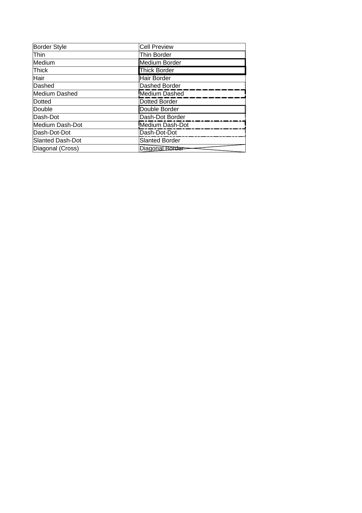</td>
<td align="center"><a href="files/borders.xlsx">Download</a></td>
<td align="center"><a href="#borders">View Code &amp; Detail</a></td>
</tr>
<tr>
<td><strong>Cell Booleans</strong></td>
<td align="center"></td>
<td align="center"><a href="files/cell_booleans.xlsx">Download</a></td>
<td align="center"><a href="#cell-booleans">View Code &amp; Detail</a></td>
</tr>
<tr>
<td><strong>Cell Dates</strong></td>
<td align="center"></td>
<td align="center"><a href="files/cell_dates.xlsx">Download</a></td>
<td align="center"><a href="#cell-dates">View Code &amp; Detail</a></td>
</tr>
<tr>
<td><strong>Cell Formulas</strong></td>
<td align="center"></td>
<td align="center"><a href="files/cell_formulas.xlsx">Download</a></td>
<td align="center"><a href="#cell-formulas">View Code &amp; Detail</a></td>
</tr>
<tr>
<td><strong>Cell Num Currency Jpy</strong></td>
<td align="center"></td>
<td align="center"><a href="files/cell_num_currency_jpy.xlsx">Download</a></td>
<td align="center"><a href="#cell-num-currency-jpy">View Code &amp; Detail</a></td>
</tr>
<tr>
<td><strong>Cell Num Custom Colors</strong></td>
<td align="center"></td>
<td align="center"><a href="files/cell_num_custom_colors.xlsx">Download</a></td>
<td align="center"><a href="#cell-num-custom-colors">View Code &amp; Detail</a></td>
</tr>
<tr>
<td><strong>Cell Num Fractions</strong></td>
<td align="center"></td>
<td align="center"><a href="files/cell_num_fractions.xlsx">Download</a></td>
<td align="center"><a href="#cell-num-fractions">View Code &amp; Detail</a></td>
</tr>
<tr>
<td><strong>Cell Num Percent Decimals</strong></td>
<td align="center"></td>
<td align="center"><a href="files/cell_num_percent_decimals.xlsx">Download</a></td>
<td align="center"><a href="#cell-num-percent-decimals">View Code &amp; Detail</a></td>
</tr>
<tr>
<td><strong>Cell Num Scientific</strong></td>
<td align="center"></td>
<td align="center"><a href="files/cell_num_scientific.xlsx">Download</a></td>
<td align="center"><a href="#cell-num-scientific">View Code &amp; Detail</a></td>
</tr>
<tr>
<td><strong>Cell Numbers</strong></td>
<td align="center"></td>
<td align="center"><a href="files/cell_numbers.xlsx">Download</a></td>
<td align="center"><a href="#cell-numbers">View Code &amp; Detail</a></td>
</tr>
<tr>
<td><strong>Cell Rich Text</strong></td>
<td align="center">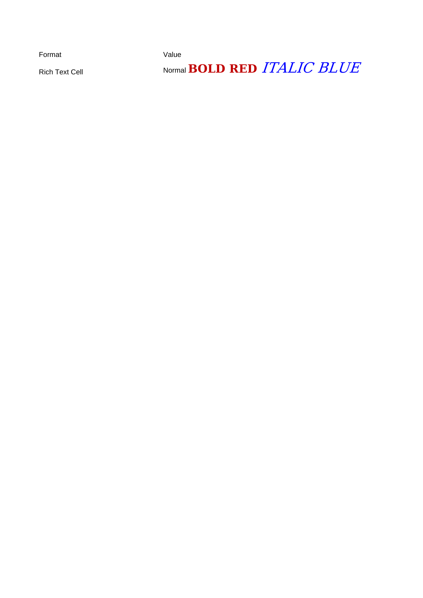</td>
<td align="center"><a href="files/cell_rich_text.xlsx">Download</a></td>
<td align="center"><a href="#cell-rich-text">View Code &amp; Detail</a></td>
</tr>
<tr>
<td><strong>Cell Times</strong></td>
<td align="center"></td>
<td align="center"><a href="files/cell_times.xlsx">Download</a></td>
<td align="center"><a href="#cell-times">View Code &amp; Detail</a></td>
</tr>
<tr>
<td><strong>Cf Begins With</strong></td>
<td align="center"></td>
<td align="center"><a href="files/cf_begins_with.xlsx">Download</a></td>
<td align="center"><a href="#cf-begins-with">View Code &amp; Detail</a></td>
</tr>
<tr>
<td><strong>Cf Cell Between</strong></td>
<td align="center"></td>
<td align="center"><a href="files/cf_cell_between.xlsx">Download</a></td>
<td align="center"><a href="#cf-cell-between">View Code &amp; Detail</a></td>
</tr>
<tr>
<td><strong>Cf Cell Equal To</strong></td>
<td align="center"></td>
<td align="center"><a href="files/cf_cell_equal_to.xlsx">Download</a></td>
<td align="center"><a href="#cf-cell-equal-to">View Code &amp; Detail</a></td>
</tr>
<tr>
<td><strong>Cf Cell Greater Equal</strong></td>
<td align="center"></td>
<td align="center"><a href="files/cf_cell_greater_equal.xlsx">Download</a></td>
<td align="center"><a href="#cf-cell-greater-equal">View Code &amp; Detail</a></td>
</tr>
<tr>
<td><strong>Cf Cell Greater Than</strong></td>
<td align="center"></td>
<td align="center"><a href="files/cf_cell_greater_than.xlsx">Download</a></td>
<td align="center"><a href="#cf-cell-greater-than">View Code &amp; Detail</a></td>
</tr>
<tr>
<td><strong>Cf Cell Less Than</strong></td>
<td align="center"></td>
<td align="center"><a href="files/cf_cell_less_than.xlsx">Download</a></td>
<td align="center"><a href="#cf-cell-less-than">View Code &amp; Detail</a></td>
</tr>
<tr>
<td><strong>Cf Color Scale</strong></td>
<td align="center"></td>
<td align="center"><a href="files/cf_color_scale.xlsx">Download</a></td>
<td align="center"><a href="#cf-color-scale">View Code &amp; Detail</a></td>
</tr>
<tr>
<td><strong>Cf Contains Text</strong></td>
<td align="center"></td>
<td align="center"><a href="files/cf_contains_text.xlsx">Download</a></td>
<td align="center"><a href="#cf-contains-text">View Code &amp; Detail</a></td>
</tr>
<tr>
<td><strong>Cf Data Bar</strong></td>
<td align="center"></td>
<td align="center"><a href="files/cf_data_bar.xlsx">Download</a></td>
<td align="center"><a href="#cf-data-bar">View Code &amp; Detail</a></td>
</tr>
<tr>
<td><strong>Cf Ends With</strong></td>
<td align="center"></td>
<td align="center"><a href="files/cf_ends_with.xlsx">Download</a></td>
<td align="center"><a href="#cf-ends-with">View Code &amp; Detail</a></td>
</tr>
<tr>
<td><strong>Cf Expression Formula</strong></td>
<td align="center"></td>
<td align="center"><a href="files/cf_expression_formula.xlsx">Download</a></td>
<td align="center"><a href="#cf-expression-formula">View Code &amp; Detail</a></td>
</tr>
<tr>
<td><strong>Cf Icon Set</strong></td>
<td align="center"></td>
<td align="center"><a href="files/cf_icon_set.xlsx">Download</a></td>
<td align="center"><a href="#cf-icon-set">View Code &amp; Detail</a></td>
</tr>
<tr>
<td><strong>Chart Area</strong></td>
<td align="center"></td>
<td align="center"><a href="files/chart_area.xlsx">Download</a></td>
<td align="center"><a href="#chart-area">View Code &amp; Detail</a></td>
</tr>
<tr>
<td><strong>Chart Area Stacked</strong></td>
<td align="center">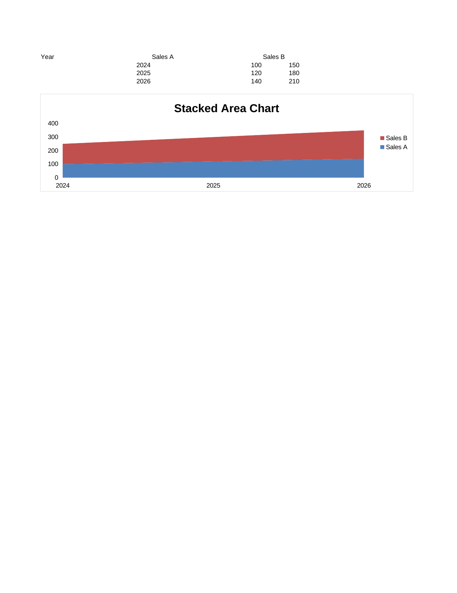</td>
<td align="center"><a href="files/chart_area_stacked.xlsx">Download</a></td>
<td align="center"><a href="#chart-area-stacked">View Code &amp; Detail</a></td>
</tr>
<tr>
<td><strong>Chart Bar</strong></td>
<td align="center"></td>
<td align="center"><a href="files/chart_bar.xlsx">Download</a></td>
<td align="center"><a href="#chart-bar">View Code &amp; Detail</a></td>
</tr>
<tr>
<td><strong>Chart Bar Percent Stacked</strong></td>
<td align="center">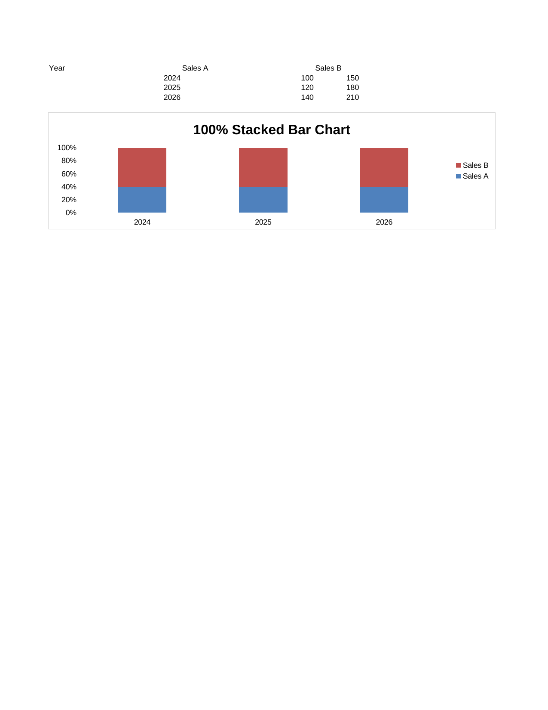</td>
<td align="center"><a href="files/chart_bar_percent_stacked.xlsx">Download</a></td>
<td align="center"><a href="#chart-bar-percent-stacked">View Code &amp; Detail</a></td>
</tr>
<tr>
<td><strong>Chart Bar Stacked</strong></td>
<td align="center">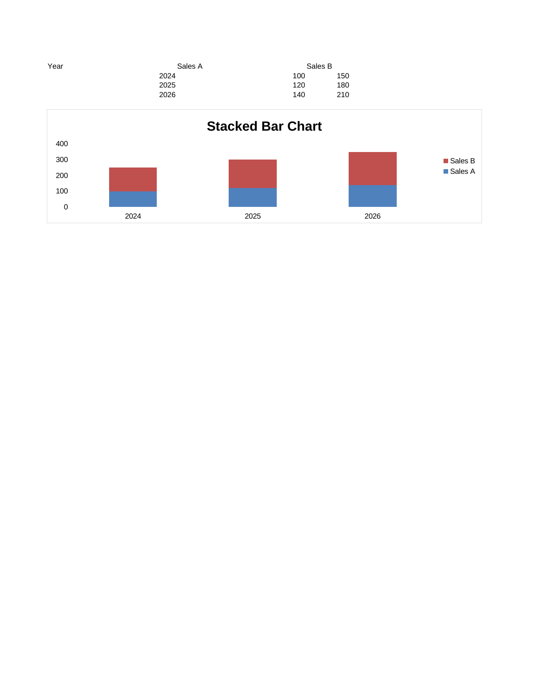</td>
<td align="center"><a href="files/chart_bar_stacked.xlsx">Download</a></td>
<td align="center"><a href="#chart-bar-stacked">View Code &amp; Detail</a></td>
</tr>
<tr>
<td><strong>Chart Doughnut</strong></td>
<td align="center"></td>
<td align="center"><a href="files/chart_doughnut.xlsx">Download</a></td>
<td align="center"><a href="#chart-doughnut">View Code &amp; Detail</a></td>
</tr>
<tr>
<td><strong>Chart Line</strong></td>
<td align="center"></td>
<td align="center"><a href="files/chart_line.xlsx">Download</a></td>
<td align="center"><a href="#chart-line">View Code &amp; Detail</a></td>
</tr>
<tr>
<td><strong>Chart Line Stacked</strong></td>
<td align="center">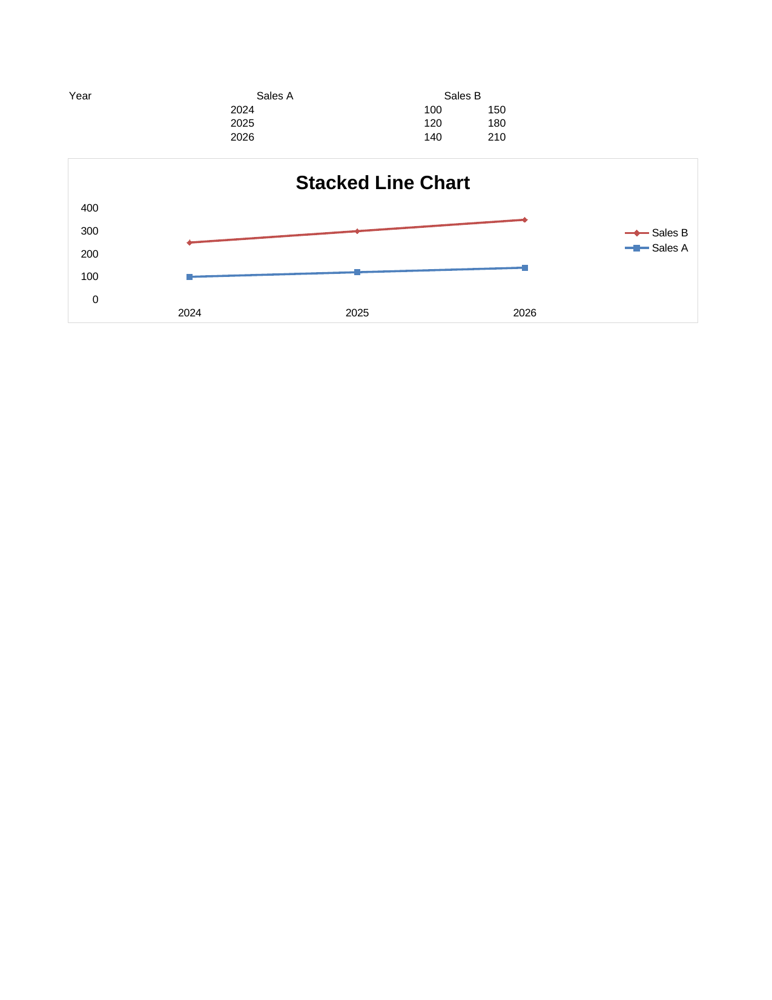</td>
<td align="center"><a href="files/chart_line_stacked.xlsx">Download</a></td>
<td align="center"><a href="#chart-line-stacked">View Code &amp; Detail</a></td>
</tr>
<tr>
<td><strong>Chart Pie</strong></td>
<td align="center"></td>
<td align="center"><a href="files/chart_pie.xlsx">Download</a></td>
<td align="center"><a href="#chart-pie">View Code &amp; Detail</a></td>
</tr>
<tr>
<td><strong>Chart Radar</strong></td>
<td align="center"></td>
<td align="center"><a href="files/chart_radar.xlsx">Download</a></td>
<td align="center"><a href="#chart-radar">View Code &amp; Detail</a></td>
</tr>
<tr>
<td><strong>Chart Scatter</strong></td>
<td align="center"></td>
<td align="center"><a href="files/chart_scatter.xlsx">Download</a></td>
<td align="center"><a href="#chart-scatter">View Code &amp; Detail</a></td>
</tr>
<tr>
<td><strong>Col Grouping</strong></td>
<td align="center"></td>
<td align="center"><a href="files/col_grouping.xlsx">Download</a></td>
<td align="center"><a href="#col-grouping">View Code &amp; Detail</a></td>
</tr>
<tr>
<td><strong>Col Width Tall</strong></td>
<td align="center"></td>
<td align="center"><a href="files/col_width_tall.xlsx">Download</a></td>
<td align="center"><a href="#col-width-tall">View Code &amp; Detail</a></td>
</tr>
<tr>
<td><strong>Col Widths</strong></td>
<td align="center"></td>
<td align="center"><a href="files/col_widths.xlsx">Download</a></td>
<td align="center"><a href="#col-widths">View Code &amp; Detail</a></td>
</tr>
<tr>
<td><strong>Conditional Formatting</strong></td>
<td align="center"></td>
<td align="center"><a href="files/conditional_formatting.xlsx">Download</a></td>
<td align="center"><a href="#conditional-formatting">View Code &amp; Detail</a></td>
</tr>
<tr>
<td><strong>Embedded Images</strong></td>
<td align="center"></td>
<td align="center"><a href="files/embedded_images.xlsx">Download</a></td>
<td align="center"><a href="#embedded-images">View Code &amp; Detail</a></td>
</tr>
<tr>
<td><strong>Fill Gradients</strong></td>
<td align="center"></td>
<td align="center"><a href="files/fill_gradients.xlsx">Download</a></td>
<td align="center"><a href="#fill-gradients">View Code &amp; Detail</a></td>
</tr>
<tr>
<td><strong>Fill Patterns</strong></td>
<td align="center"></td>
<td align="center"><a href="files/fill_patterns.xlsx">Download</a></td>
<td align="center"><a href="#fill-patterns">View Code &amp; Detail</a></td>
</tr>
<tr>
<td><strong>Fill Solid Colors</strong></td>
<td align="center"></td>
<td align="center"><a href="files/fill_solid_colors.xlsx">Download</a></td>
<td align="center"><a href="#fill-solid-colors">View Code &amp; Detail</a></td>
</tr>
<tr>
<td><strong>Fonts</strong></td>
<td align="center">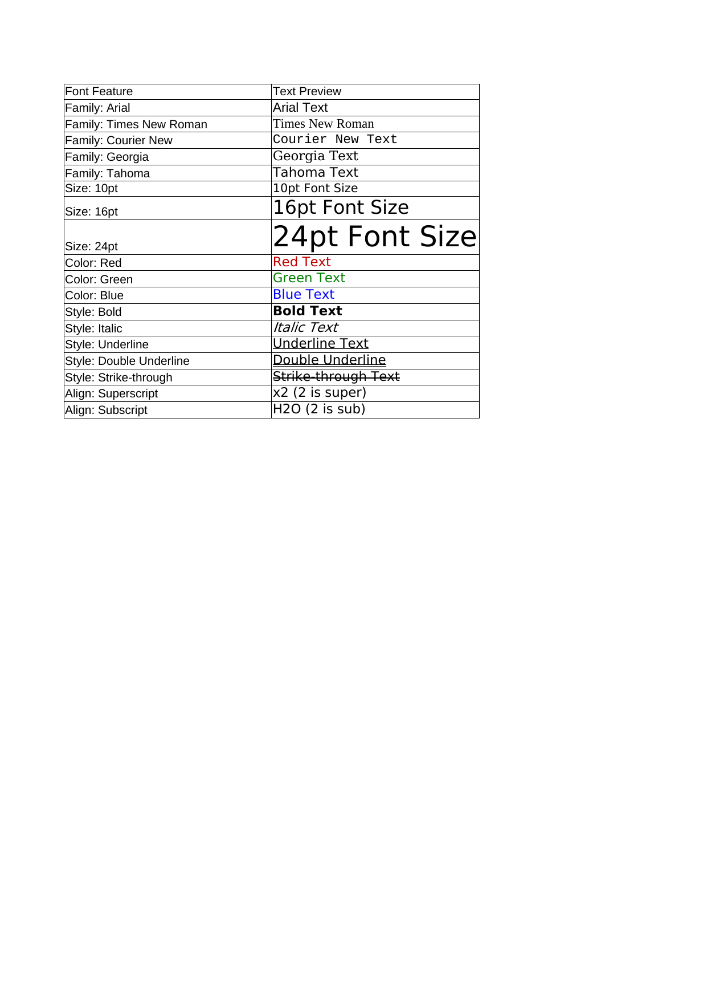</td>
<td align="center"><a href="files/fonts.xlsx">Download</a></td>
<td align="center"><a href="#fonts">View Code &amp; Detail</a></td>
</tr>
<tr>
<td><strong>Interactive Autofilter</strong></td>
<td align="center"></td>
<td align="center"><a href="files/interactive_autofilter.xlsx">Download</a></td>
<td align="center"><a href="#interactive-autofilter">View Code &amp; Detail</a></td>
</tr>
<tr>
<td><strong>Interactive Comments</strong></td>
<td align="center"></td>
<td align="center"><a href="files/interactive_comments.xlsx">Download</a></td>
<td align="center"><a href="#interactive-comments">View Code &amp; Detail</a></td>
</tr>
<tr>
<td><strong>Interactive Validation Custom</strong></td>
<td align="center"></td>
<td align="center"><a href="files/interactive_validation_custom.xlsx">Download</a></td>
<td align="center"><a href="#interactive-validation-custom">View Code &amp; Detail</a></td>
</tr>
<tr>
<td><strong>Interactive Validation Date</strong></td>
<td align="center"></td>
<td align="center"><a href="files/interactive_validation_date.xlsx">Download</a></td>
<td align="center"><a href="#interactive-validation-date">View Code &amp; Detail</a></td>
</tr>
<tr>
<td><strong>Interactive Validation List</strong></td>
<td align="center"></td>
<td align="center"><a href="files/interactive_validation_list.xlsx">Download</a></td>
<td align="center"><a href="#interactive-validation-list">View Code &amp; Detail</a></td>
</tr>
<tr>
<td><strong>Interactive Validation Range</strong></td>
<td align="center"></td>
<td align="center"><a href="files/interactive_validation_range.xlsx">Download</a></td>
<td align="center"><a href="#interactive-validation-range">View Code &amp; Detail</a></td>
</tr>
<tr>
<td><strong>Interactive Validation Text Length</strong></td>
<td align="center"></td>
<td align="center"><a href="files/interactive_validation_text_length.xlsx">Download</a></td>
<td align="center"><a href="#interactive-validation-text-length">View Code &amp; Detail</a></td>
</tr>
<tr>
<td><strong>Interactive Validation Time</strong></td>
<td align="center"></td>
<td align="center"><a href="files/interactive_validation_time.xlsx">Download</a></td>
<td align="center"><a href="#interactive-validation-time">View Code &amp; Detail</a></td>
</tr>
<tr>
<td><strong>Japanese Text</strong></td>
<td align="center"></td>
<td align="center"><a href="files/japanese_text.xlsx">Download</a></td>
<td align="center"><a href="#japanese-text">View Code &amp; Detail</a></td>
</tr>
<tr>
<td><strong>Merge Freeze</strong></td>
<td align="center"></td>
<td align="center"><a href="files/merge_freeze.xlsx">Download</a></td>
<td align="center"><a href="#merge-freeze">View Code &amp; Detail</a></td>
</tr>
<tr>
<td><strong>Page Grid Lines Print</strong></td>
<td align="center"></td>
<td align="center"><a href="files/page_grid_lines_print.xlsx">Download</a></td>
<td align="center"><a href="#page-grid-lines-print">View Code &amp; Detail</a></td>
</tr>
<tr>
<td><strong>Page Header Footer</strong></td>
<td align="center">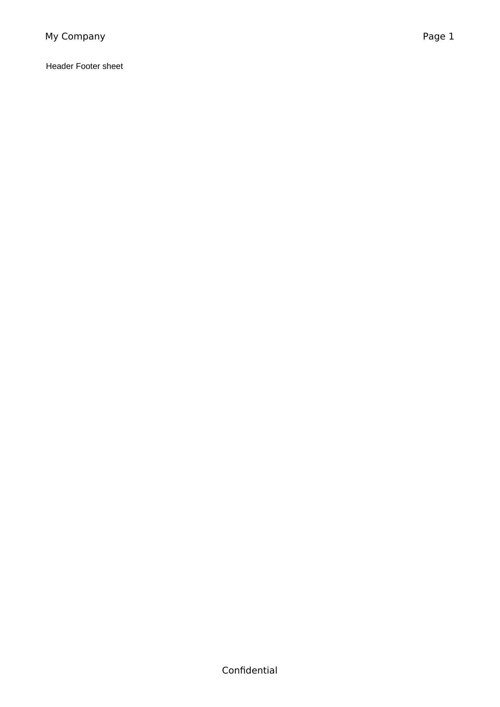</td>
<td align="center"><a href="files/page_header_footer.xlsx">Download</a></td>
<td align="center"><a href="#page-header-footer">View Code &amp; Detail</a></td>
</tr>
<tr>
<td><strong>Page Headings Print</strong></td>
<td align="center"></td>
<td align="center"><a href="files/page_headings_print.xlsx">Download</a></td>
<td align="center"><a href="#page-headings-print">View Code &amp; Detail</a></td>
</tr>
<tr>
<td><strong>Page Margins Narrow</strong></td>
<td align="center"></td>
<td align="center"><a href="files/page_margins_narrow.xlsx">Download</a></td>
<td align="center"><a href="#page-margins-narrow">View Code &amp; Detail</a></td>
</tr>
<tr>
<td><strong>Page Margins Wide</strong></td>
<td align="center"></td>
<td align="center"><a href="files/page_margins_wide.xlsx">Download</a></td>
<td align="center"><a href="#page-margins-wide">View Code &amp; Detail</a></td>
</tr>
<tr>
<td><strong>Page Orientation Landscape</strong></td>
<td align="center"></td>
<td align="center"><a href="files/page_orientation_landscape.xlsx">Download</a></td>
<td align="center"><a href="#page-orientation-landscape">View Code &amp; Detail</a></td>
</tr>
<tr>
<td><strong>Page Paper Size A3</strong></td>
<td align="center"></td>
<td align="center"><a href="files/page_paper_size_a3.xlsx">Download</a></td>
<td align="center"><a href="#page-paper-size-a3">View Code &amp; Detail</a></td>
</tr>
<tr>
<td><strong>Row Grouping</strong></td>
<td align="center"></td>
<td align="center"><a href="files/row_grouping.xlsx">Download</a></td>
<td align="center"><a href="#row-grouping">View Code &amp; Detail</a></td>
</tr>
<tr>
<td><strong>Row Height Tall</strong></td>
<td align="center"></td>
<td align="center"><a href="files/row_height_tall.xlsx">Download</a></td>
<td align="center"><a href="#row-height-tall">View Code &amp; Detail</a></td>
</tr>
<tr>
<td><strong>Row Heights</strong></td>
<td align="center"></td>
<td align="center"><a href="files/row_heights.xlsx">Download</a></td>
<td align="center"><a href="#row-heights">View Code &amp; Detail</a></td>
</tr>
<tr>
<td><strong>Sheet Tab Colors</strong></td>
<td align="center"></td>
<td align="center"><a href="files/sheet_tab_colors.xlsx">Download</a></td>
<td align="center"><a href="#sheet-tab-colors">View Code &amp; Detail</a></td>
</tr>
<tr>
<td><strong>Sparkline Column</strong></td>
<td align="center"></td>
<td align="center"><a href="files/sparkline_column.xlsx">Download</a></td>
<td align="center"><a href="#sparkline-column">View Code &amp; Detail</a></td>
</tr>
<tr>
<td><strong>Sparkline Line</strong></td>
<td align="center"></td>
<td align="center"><a href="files/sparkline_line.xlsx">Download</a></td>
<td align="center"><a href="#sparkline-line">View Code &amp; Detail</a></td>
</tr>
<tr>
<td><strong>Styles Fonts Fills</strong></td>
<td align="center"></td>
<td align="center"><a href="files/styles_fonts_fills.xlsx">Download</a></td>
<td align="center"><a href="#styles-fonts-fills">View Code &amp; Detail</a></td>
</tr>
<tr>
<td><strong>View Show Grid Lines</strong></td>
<td align="center"></td>
<td align="center"><a href="files/view_show_grid_lines.xlsx">Download</a></td>
<td align="center"><a href="#view-show-grid-lines">View Code &amp; Detail</a></td>
</tr>
<tr>
<td><strong>View Zoom Scale</strong></td>
<td align="center"></td>
<td align="center"><a href="files/view_zoom_scale.xlsx">Download</a></td>
<td align="center"><a href="#view-zoom-scale">View Code &amp; Detail</a></td>
</tr>
<tr>
<td><strong>Workbook Three Sheets</strong></td>
<td align="center"></td>
<td align="center"><a href="files/workbook_three_sheets.xlsx">Download</a></td>
<td align="center"><a href="#workbook-three-sheets">View Code &amp; Detail</a></td>
</tr>
</tbody>
</table>


---

## Align Horizontal

[Download .xlsx](files/align_horizontal.xlsx)

Demonstrates horizontal text alignment (left, center, right).

### Rendered Output (LibreOffice Calc)

<div></div>

### DSL Code

```ruby
# frozen_string_literal: true

require "xlsxrb"
output_path = ARGV[0] || "align_horizontal.xlsx"
Xlsxrb.generate(output_path) do |w|
  w.style("left") { |s| s.align_horizontal("left") }
  w.style("center") { |s| s.align_horizontal("center") }
  w.style("right") { |s| s.align_horizontal("right") }
  w.sheet("Alignment") do |s|
    s.print_options(:grid_lines, true)
    s.column(0, width: 20)
    s.column(1, width: 20)
    s.column(2, width: 20)
    s.row(%w[Left Center Right], styles: { 0 => "left", 1 => "center", 2 => "right" })
  end
end

# 2. Read the generated sheet and print the parsed alignments
puts "=== Read Alignment (Xlsxrb.read) ==="
workbook = Xlsxrb.read(output_path)
sheet = workbook.sheets.first
row = sheet.rows.first

row.cells.each do |c|
  xf = workbook.styles[:cell_xfs][c.style_index] if c.style_index
  align_h = xf&.dig(:alignment, :horizontal)
  puts "Cell #{c.ref} ('#{c.value}'): align_horizontal = #{align_h.inspect}"
end
```

### Console Output

```text
=== Read Alignment (Xlsxrb.read) ===
Cell A1 ('Left'): align_horizontal = "left"
Cell B1 ('Center'): align_horizontal = "center"
Cell C1 ('Right'): align_horizontal = "right"
```

<hr/>

## Align Horizontal Fill

[Download .xlsx](files/align_horizontal_fill.xlsx)

Demonstrates horizontal fill alignment (repeats value to fill cell width).

### Rendered Output (LibreOffice Calc)

<div></div>

### DSL Code

```ruby
# frozen_string_literal: true

require "xlsxrb"
output_path = ARGV[0] || "align_horizontal_fill.xlsx"
Xlsxrb.generate(output_path) do |w|
  w.style("fill_align") { |s| s.align_horizontal("fill") }
  w.sheet("Alignment") do |s|
    s.column(0, width: 30)
    s.row(["X "], styles: { 0 => "fill_align" })
  end
end

# 2. Read the generated sheet and print the parsed alignments
puts "=== Read Validation ==="
workbook = Xlsxrb.read(output_path)
sheet = workbook.sheets.first
row = sheet.rows.first
row.cells.each do |c|
  xf = workbook.styles[:cell_xfs][c.style_index] if c.style_index
  align_h = xf&.dig(:alignment, :horizontal)
  align_v = xf&.dig(:alignment, :vertical)
  wrap = xf&.dig(:alignment, :wrap_text)
  indent = xf&.dig(:alignment, :indent)
  rot = xf&.dig(:alignment, :text_rotation)
  shrink = xf&.dig(:alignment, :shrink_to_fit)
  puts "Cell #{c.ref} ('#{c.value}'): align_h=#{align_h.inspect}, align_v=#{align_v.inspect}, wrap=#{wrap.inspect}, indent=#{indent.inspect}, rotation=#{rot.inspect}, shrink=#{shrink.inspect}"
end
```

### Console Output

```text
=== Read Validation ===
Cell A1 ('X '): align_h="fill", align_v=nil, wrap=nil, indent=nil, rotation=nil, shrink=nil
```

<hr/>

## Align Horizontal Justify

[Download .xlsx](files/align_horizontal_justify.xlsx)

Demonstrates horizontal justify text alignment.

### Rendered Output (LibreOffice Calc)

<div></div>

### DSL Code

```ruby
# frozen_string_literal: true

require "xlsxrb"
output_path = ARGV[0] || "align_horizontal_justify.xlsx"
Xlsxrb.generate(output_path) do |w|
  w.style("justify_align") do |s|
    s.align_horizontal("justify")
    s.wrap_text(true)
  end
  w.sheet("Alignment") do |s|
    s.column(0, width: 25)
    s.row(["Justified alignment wraps and distributes text evenly."], styles: { 0 => "justify_align" })
  end
end

# 2. Read the generated sheet and print the parsed alignments
puts "=== Read Validation ==="
workbook = Xlsxrb.read(output_path)
sheet = workbook.sheets.first
row = sheet.rows.first
row.cells.each do |c|
  xf = workbook.styles[:cell_xfs][c.style_index] if c.style_index
  align_h = xf&.dig(:alignment, :horizontal)
  align_v = xf&.dig(:alignment, :vertical)
  wrap = xf&.dig(:alignment, :wrap_text)
  indent = xf&.dig(:alignment, :indent)
  rot = xf&.dig(:alignment, :text_rotation)
  shrink = xf&.dig(:alignment, :shrink_to_fit)
  puts "Cell #{c.ref} ('#{c.value}'): align_h=#{align_h.inspect}, align_v=#{align_v.inspect}, wrap=#{wrap.inspect}, indent=#{indent.inspect}, rotation=#{rot.inspect}, shrink=#{shrink.inspect}"
end
```

### Console Output

```text
=== Read Validation ===
Cell A1 ('Justified alignment wraps and distributes text evenly.'): align_h="justify", align_v=nil, wrap=true, indent=nil, rotation=nil, shrink=nil
```

<hr/>

## Align Indent

[Download .xlsx](files/align_indent.xlsx)

Demonstrates text indentation inside cells.

### Rendered Output (LibreOffice Calc)

<div></div>

### DSL Code

```ruby
# frozen_string_literal: true

require "xlsxrb"
output_path = ARGV[0] || "align_indent.xlsx"
Xlsxrb.generate(output_path) do |w|
  w.style("indent_1") { |s| s.align_horizontal("left").indent(1) }
  w.style("indent_3") { |s| s.align_horizontal("left").indent(3) }
  w.sheet("Indent") do |s|
    s.column(0, width: 25)
    s.column(1, width: 25)
    s.print_options(:grid_lines, true)
    s.row(["No Indent"])
    s.row(["Indent 1"], styles: { 0 => "indent_1" })
    s.row(["Indent 3"], styles: { 0 => "indent_3" })
  end
end

# 2. Read the generated sheet and print the parsed alignments
puts "=== Read Validation ==="
workbook = Xlsxrb.read(output_path)
sheet = workbook.sheets.first
row = sheet.rows.first
row.cells.each do |c|
  xf = workbook.styles[:cell_xfs][c.style_index] if c.style_index
  align_h = xf&.dig(:alignment, :horizontal)
  align_v = xf&.dig(:alignment, :vertical)
  wrap = xf&.dig(:alignment, :wrap_text)
  indent = xf&.dig(:alignment, :indent)
  rot = xf&.dig(:alignment, :text_rotation)
  shrink = xf&.dig(:alignment, :shrink_to_fit)
  puts "Cell #{c.ref} ('#{c.value}'): align_h=#{align_h.inspect}, align_v=#{align_v.inspect}, wrap=#{wrap.inspect}, indent=#{indent.inspect}, rotation=#{rot.inspect}, shrink=#{shrink.inspect}"
end
```

### Console Output

```text
=== Read Validation ===
Cell A1 ('No Indent'): align_h=nil, align_v=nil, wrap=nil, indent=nil, rotation=nil, shrink=nil
```

<hr/>

## Align Text Rotation

[Download .xlsx](files/align_text_rotation.xlsx)

Demonstrates text rotated by specific angles (45, 90 degrees).

### Rendered Output (LibreOffice Calc)

<div></div>

### DSL Code

```ruby
# frozen_string_literal: true

require "xlsxrb"
output_path = ARGV[0] || "align_text_rotation.xlsx"
Xlsxrb.generate(output_path) do |w|
  w.style("rot_45") { |s| s.text_rotation(45) }
  w.style("rot_90") { |s| s.text_rotation(90) }
  w.sheet("Rotation") do |s|
    s.column(0, width: 25)
    s.column(1, width: 25)
    s.print_options(:grid_lines, true)
    s.row(["Rotated 45", "Rotated 90"], styles: { 0 => "rot_45", 1 => "rot_90" }, height: 50)
  end
end

# 2. Read the generated sheet and print the parsed alignments
puts "=== Read Validation ==="
workbook = Xlsxrb.read(output_path)
sheet = workbook.sheets.first
row = sheet.rows.first
row.cells.each do |c|
  xf = workbook.styles[:cell_xfs][c.style_index] if c.style_index
  align_h = xf&.dig(:alignment, :horizontal)
  align_v = xf&.dig(:alignment, :vertical)
  wrap = xf&.dig(:alignment, :wrap_text)
  indent = xf&.dig(:alignment, :indent)
  rot = xf&.dig(:alignment, :text_rotation)
  shrink = xf&.dig(:alignment, :shrink_to_fit)
  puts "Cell #{c.ref} ('#{c.value}'): align_h=#{align_h.inspect}, align_v=#{align_v.inspect}, wrap=#{wrap.inspect}, indent=#{indent.inspect}, rotation=#{rot.inspect}, shrink=#{shrink.inspect}"
end
```

### Console Output

```text
=== Read Validation ===
Cell A1 ('Rotated 45'): align_h=nil, align_v=nil, wrap=nil, indent=nil, rotation=45, shrink=nil
Cell B1 ('Rotated 90'): align_h=nil, align_v=nil, wrap=nil, indent=nil, rotation=90, shrink=nil
```

<hr/>

## Align Text Wrap

[Download .xlsx](files/align_text_wrap.xlsx)

Demonstrates auto-wrapping multi-line text inside narrow cells.

### Rendered Output (LibreOffice Calc)

<div></div>

### DSL Code

```ruby
# frozen_string_literal: true

require "xlsxrb"
output_path = ARGV[0] || "align_text_wrap.xlsx"
Xlsxrb.generate(output_path) do |w|
  w.style("wrap", &:wrap_text)
  w.sheet("Text Wrap") do |s|
    s.print_options(:grid_lines, true)
    s.column(0, width: 15)
    s.row(["This is a long sentence that wraps inside the cell."], styles: { 0 => "wrap" })
  end
end

# 2. Read the generated sheet and print the parsed alignments
puts "=== Read Validation ==="
workbook = Xlsxrb.read(output_path)
sheet = workbook.sheets.first
row = sheet.rows.first
row.cells.each do |c|
  xf = workbook.styles[:cell_xfs][c.style_index] if c.style_index
  align_h = xf&.dig(:alignment, :horizontal)
  align_v = xf&.dig(:alignment, :vertical)
  wrap = xf&.dig(:alignment, :wrap_text)
  indent = xf&.dig(:alignment, :indent)
  rot = xf&.dig(:alignment, :text_rotation)
  shrink = xf&.dig(:alignment, :shrink_to_fit)
  puts "Cell #{c.ref} ('#{c.value}'): align_h=#{align_h.inspect}, align_v=#{align_v.inspect}, wrap=#{wrap.inspect}, indent=#{indent.inspect}, rotation=#{rot.inspect}, shrink=#{shrink.inspect}"
end
```

### Console Output

```text
=== Read Validation ===
Cell A1 ('This is a long sentence that wraps inside the cell.'): align_h=nil, align_v=nil, wrap=true, indent=nil, rotation=nil, shrink=nil
```

<hr/>

## Align Vertical

[Download .xlsx](files/align_vertical.xlsx)

Demonstrates vertical text alignment (top, center, bottom).

### Rendered Output (LibreOffice Calc)

<div></div>

### DSL Code

```ruby
# frozen_string_literal: true

require "xlsxrb"
output_path = ARGV[0] || "align_vertical.xlsx"
Xlsxrb.generate(output_path) do |w|
  w.style("top") { |s| s.align_vertical("top") }
  w.style("center") { |s| s.align_vertical("center") }
  w.style("bottom") { |s| s.align_vertical("bottom") }
  w.sheet("Vertical Alignment") do |s|
    s.column(0, width: 25)
    s.column(1, width: 25)
    s.print_options(:grid_lines, true)
    s.row(%w[Top Center Bottom], styles: { 0 => "top", 1 => "center", 2 => "bottom" }, height: 40)
  end
end

# 2. Read the generated sheet and print the parsed alignments
puts "=== Read Validation ==="
workbook = Xlsxrb.read(output_path)
sheet = workbook.sheets.first
row = sheet.rows.first
row.cells.each do |c|
  xf = workbook.styles[:cell_xfs][c.style_index] if c.style_index
  align_h = xf&.dig(:alignment, :horizontal)
  align_v = xf&.dig(:alignment, :vertical)
  wrap = xf&.dig(:alignment, :wrap_text)
  indent = xf&.dig(:alignment, :indent)
  rot = xf&.dig(:alignment, :text_rotation)
  shrink = xf&.dig(:alignment, :shrink_to_fit)
  puts "Cell #{c.ref} ('#{c.value}'): align_h=#{align_h.inspect}, align_v=#{align_v.inspect}, wrap=#{wrap.inspect}, indent=#{indent.inspect}, rotation=#{rot.inspect}, shrink=#{shrink.inspect}"
end
```

### Console Output

```text
=== Read Validation ===
Cell A1 ('Top'): align_h=nil, align_v="top", wrap=nil, indent=nil, rotation=nil, shrink=nil
Cell B1 ('Center'): align_h=nil, align_v="center", wrap=nil, indent=nil, rotation=nil, shrink=nil
Cell C1 ('Bottom'): align_h=nil, align_v="bottom", wrap=nil, indent=nil, rotation=nil, shrink=nil
```

<hr/>

## Basic Data

[Download .xlsx](files/basic_data.xlsx)

Demonstrates simple tabular data writing with basic Ruby types (Strings, Numbers, Dates, Booleans).

### Rendered Output (LibreOffice Calc)

<div></div>

### DSL Code

```ruby
# frozen_string_literal: true

require "xlsxrb"
require "date"

output_path = ARGV[0] || "basic_data.xlsx"

Xlsxrb.generate(output_path) do |w|
  w.style("currency") { |style| style.number_format("$#,##0.00") }
  w.style("date") { |style| style.number_format("yyyy-mm-dd") }
  w.sheet("Basic Data") do
    w.sheet_properties(:fit_to_page, true)
    w.page_setup(fit_to_width: 1, fit_to_height: 1)
    w.column(0, width: 25)
    w.column(1, width: 25)
    w.row(%w[Product Qty Price Date Active])
    w.row(["Gadget A", 10, 99.99, Date.new(2026, 1, 15), true], styles: { 2 => "currency", 3 => "date" })
    w.row(["Widget B", 5, 49.50, Date.new(2026, 2, 20), false], styles: { 2 => "currency", 3 => "date" })
  end
end

# 2. Read the generated sheet and print parsed cell values and Ruby classes
puts "=== Read Validation ==="
workbook = Xlsxrb.read(output_path)
sheet = workbook.sheets.first
sheet.rows.each do |row|
  row_cells = row.cells.map do |c|
    "#{c.ref}: #{c.value.inspect} (#{c.value.class})"
  end
  puts "Row #{row.index}: #{row_cells.join(", ")}"
end
```

### Console Output

```text
=== Read Validation ===
Row 0: A1: "Product" (String), B1: "Qty" (String), C1: "Price" (String), D1: "Date" (String), E1: "Active" (String)
Row 1: A2: "Gadget A" (String), B2: 10 (Integer), C2: 99.99 (Float), D2: 46037 (Integer), E2: true (TrueClass)
Row 2: A3: "Widget B" (String), B3: 5 (Integer), C3: 49.5 (Float), D3: 46073 (Integer), E3: false (FalseClass)
```

<hr/>

## Borders

[Download .xlsx](files/borders.xlsx)

Demonstrates border styles (thin, medium, thick, hair, dashed, medium dashed, dotted, double, dash-dot, medium dash-dot, dash-dot-dot, slanted, and diagonal cross borders) applied to cell ranges.

### Rendered Output (LibreOffice Calc)

<div></div>

### DSL Code

```ruby
# frozen_string_literal: true

require "xlsxrb"

output_path = ARGV[0] || "borders.xlsx"

Xlsxrb.generate(output_path) do |w|
  w.style("thin") { |s| s.border_all(style: "thin", color: "FF000000") }
  w.style("medium") { |s| s.border_all(style: "medium", color: "FF000000") }
  w.style("thick") { |s| s.border_all(style: "thick", color: "FF000000") }
  w.style("hair") { |s| s.border_all(style: "hair", color: "FF000000") }
  w.style("dashed") { |s| s.border_all(style: "dashed", color: "FF000000") }
  w.style("medium_dashed") { |s| s.border_all(style: "mediumDashed", color: "FF000000") }
  w.style("dotted") { |s| s.border_all(style: "dotted", color: "FF000000") }
  w.style("double") { |s| s.border_all(style: "double", color: "FF000000") }
  w.style("dash_dot") { |s| s.border_all(style: "dashDot", color: "FF000000") }
  w.style("medium_dash_dot") { |s| s.border_all(style: "mediumDashDot", color: "FF000000") }
  w.style("dash_dot_dot") { |s| s.border_all(style: "dashDotDot", color: "FF000000") }
  w.style("slanted") { |s| s.border_all(style: "slantedDashDot", color: "FF000000") }
  w.style("diagonal") { |s| s.border_diagonal(style: "thin", color: "FF000000", up: true, down: true) }

  w.sheet("Borders") do |s|
    s.column(0, width: 25)
    s.column(1, width: 25)
    s.print_options(:grid_lines, true)

    s.row(["Border Style", "Cell Preview"])
    s.row(["Thin", "Thin Border"], styles: { 1 => "thin" })
    s.row(["Medium", "Medium Border"], styles: { 1 => "medium" })
    s.row(["Thick", "Thick Border"], styles: { 1 => "thick" })
    s.row(["Hair", "Hair Border"], styles: { 1 => "hair" })
    s.row(["Dashed", "Dashed Border"], styles: { 1 => "dashed" })
    s.row(["Medium Dashed", "Medium Dashed"], styles: { 1 => "medium_dashed" })
    s.row(["Dotted", "Dotted Border"], styles: { 1 => "dotted" })
    s.row(["Double", "Double Border"], styles: { 1 => "double" })
    s.row(["Dash-Dot", "Dash-Dot Border"], styles: { 1 => "dash_dot" })
    s.row(["Medium Dash-Dot", "Medium Dash-Dot"], styles: { 1 => "medium_dash_dot" })
    s.row(%w[Dash-Dot-Dot Dash-Dot-Dot], styles: { 1 => "dash_dot_dot" })
    s.row(["Slanted Dash-Dot", "Slanted Border"], styles: { 1 => "slanted" })
    s.row(["Diagonal (Cross)", "Diagonal Border"], styles: { 1 => "diagonal" })
  end
end

# Read check
puts "=== Read Validation ==="
workbook = Xlsxrb.read(output_path)
sheet = workbook.sheets.first
sheet.rows.each do |row|
  row_cells = row.cells.map do |c|
    xf = workbook.styles[:cell_xfs][c.style_index] if c.style_index
    border_id = xf ? xf[:border_id] : 0
    "#{c.ref}: #{c.value.inspect} (border_id: #{border_id})"
  end
  puts "Row #{row.index}: #{row_cells.join(", ")}"
end
```

### Console Output

```text
=== Read Validation ===
Row 0: A1: "Border Style" (border_id: 0), B1: "Cell Preview" (border_id: 0)
Row 1: A2: "Thin" (border_id: 0), B2: "Thin Border" (border_id: 1)
Row 2: A3: "Medium" (border_id: 0), B3: "Medium Border" (border_id: 2)
Row 3: A4: "Thick" (border_id: 0), B4: "Thick Border" (border_id: 3)
Row 4: A5: "Hair" (border_id: 0), B5: "Hair Border" (border_id: 4)
Row 5: A6: "Dashed" (border_id: 0), B6: "Dashed Border" (border_id: 5)
Row 6: A7: "Medium Dashed" (border_id: 0), B7: "Medium Dashed" (border_id: 6)
Row 7: A8: "Dotted" (border_id: 0), B8: "Dotted Border" (border_id: 7)
Row 8: A9: "Double" (border_id: 0), B9: "Double Border" (border_id: 8)
Row 9: A10: "Dash-Dot" (border_id: 0), B10: "Dash-Dot Border" (border_id: 9)
Row 10: A11: "Medium Dash-Dot" (border_id: 0), B11: "Medium Dash-Dot" (border_id: 10)
Row 11: A12: "Dash-Dot-Dot" (border_id: 0), B12: "Dash-Dot-Dot" (border_id: 11)
Row 12: A13: "Slanted Dash-Dot" (border_id: 0), B13: "Slanted Border" (border_id: 12)
Row 13: A14: "Diagonal (Cross)" (border_id: 0), B14: "Diagonal Border" (border_id: 13)
```

<hr/>

## Cell Booleans

[Download .xlsx](files/cell_booleans.xlsx)

Demonstrates boolean values serialized and rendered.

### Rendered Output (LibreOffice Calc)

<div></div>

### DSL Code

```ruby
# frozen_string_literal: true

require "xlsxrb"
output_path = ARGV[0] || "cell_booleans.xlsx"
Xlsxrb.generate(output_path) do |w|
  w.sheet("Booleans") do |s|
    s.column(0, width: 25)
    s.column(1, width: 25)
    s.row(["Label", "Boolean Value"])
    s.row(["Is Active", true])
    s.row(["Is Pending", false])
  end
end

# 2. Read the generated sheet and print parsed cell values and Ruby classes
puts "=== Read Validation ==="
workbook = Xlsxrb.read(output_path)
sheet = workbook.sheets.first
sheet.rows.each do |row|
  row_cells = row.cells.map do |c|
    "#{c.ref}: #{c.value.inspect} (#{c.value.class})"
  end
  puts "Row #{row.index}: #{row_cells.join(", ")}"
end
```

### Console Output

```text
=== Read Validation ===
Row 0: A1: "Label" (String), B1: "Boolean Value" (String)
Row 1: A2: "Is Active" (String), B2: true (TrueClass)
Row 2: A3: "Is Pending" (String), B3: false (FalseClass)
```

<hr/>

## Cell Dates

[Download .xlsx](files/cell_dates.xlsx)

Demonstrates dates serialized natively and formatted with standard or custom format strings.

### Rendered Output (LibreOffice Calc)

<div></div>

### DSL Code

```ruby
# frozen_string_literal: true

require "xlsxrb"
require "date"
output_path = ARGV[0] || "cell_dates.xlsx"
Xlsxrb.generate(output_path) do |w|
  w.style("custom_date") { |s| s.num_fmt("yyyy-mm-dd") }
  w.sheet("Dates") do |s|
    s.column(0, width: 25)
    s.column(1, width: 25)
    s.row(["Format", "Date Value"])
    s.row(["Default Date", Date.new(2026, 7, 1)])
    s.row(["Formatted Date", Date.new(2026, 12, 25)], styles: { 1 => "custom_date" })
  end
end

# 2. Read the generated sheet and print parsed cell values and Ruby classes
puts "=== Read Validation ==="
workbook = Xlsxrb.read(output_path)
sheet = workbook.sheets.first
sheet.rows.each do |row|
  row_cells = row.cells.map do |c|
    "#{c.ref}: #{c.value.inspect} (#{c.value.class})"
  end
  puts "Row #{row.index}: #{row_cells.join(", ")}"
end
```

### Console Output

```text
=== Read Validation ===
Row 0: A1: "Format" (String), B1: "Date Value" (String)
Row 1: A2: "Default Date" (String), B2: 46204 (Integer)
Row 2: A3: "Formatted Date" (String), B3: 46381 (Integer)
```

<hr/>

## Cell Formulas

[Download .xlsx](files/cell_formulas.xlsx)

Demonstrates standard spreadsheet calculations and formulas (SUM, AVERAGE).

### Rendered Output (LibreOffice Calc)

<div></div>

### DSL Code

```ruby
# frozen_string_literal: true

require "xlsxrb"
output_path = ARGV[0] || "cell_formulas.xlsx"
Xlsxrb.generate(output_path) do |w|
  w.sheet("Formulas") do |s|
    s.column(0, width: 25)
    s.column(1, width: 25)
    s.row(%w[Item Value])
    s.row(["A", 10])
    s.row(["B", 20])
    s.row(["SUM", Xlsxrb::Elements::Formula.new(expression: "SUM(B2:B3)", cached_value: 30)])
    s.row(["AVERAGE", Xlsxrb::Elements::Formula.new(expression: "AVERAGE(B2:B3)", cached_value: 15)])
  end
end

# 2. Read the generated sheet and print parsed cell values and Ruby classes
puts "=== Read Validation ==="
workbook = Xlsxrb.read(output_path)
sheet = workbook.sheets.first
sheet.rows.each do |row|
  row_cells = row.cells.map do |c|
    "#{c.ref}: #{c.value.inspect} (#{c.value.class})"
  end
  puts "Row #{row.index}: #{row_cells.join(", ")}"
end
```

### Console Output

```text
=== Read Validation ===
Row 0: A1: "Item" (String), B1: "Value" (String)
Row 1: A2: "A" (String), B2: 10 (Integer)
Row 2: A3: "B" (String), B3: 20 (Integer)
Row 3: A4: "SUM" (String), B4: 30 (Integer)
Row 4: A5: "AVERAGE" (String), B5: 15 (Integer)
```

<hr/>

## Cell Num Currency Jpy

[Download .xlsx](files/cell_num_currency_jpy.xlsx)

Demonstrates Yen Currency format code formatting.

### Rendered Output (LibreOffice Calc)

<div></div>

### DSL Code

```ruby
# frozen_string_literal: true

require "xlsxrb"
output_path = ARGV[0] || "cell_num_currency_jpy.xlsx"
Xlsxrb.generate(output_path) do |w|
  w.style("jpy") { |s| s.num_fmt("¥#,##0;[Red]¥-#,##0") }
  w.sheet("JPY Currency") do |s|
    s.column(0, width: 25)
    s.column(1, width: 25)
    s.row(%w[Format Value])
    s.row(["Positive Yen", 12_500], styles: { 1 => "jpy" })
    s.row(["Negative Yen", -8000], styles: { 1 => "jpy" })
  end
end

# 2. Read the generated sheet and print parsed cell numbers and format codes
puts "=== Read Validation ==="
workbook = Xlsxrb.read(output_path)
sheet = workbook.sheets.first
sheet.rows.each do |row|
  row_cells = row.cells.map do |c|
    xf = workbook.styles[:cell_xfs][c.style_index] if c.style_index
    num_fmt = xf ? workbook.styles[:num_fmts][xf[:num_fmt_id]] : nil
    "#{c.ref}: #{c.value.inspect} (Format ID: #{xf&.[](:num_fmt_id)}, Code: #{num_fmt.inspect})"
  end
  puts "Row #{row.index}: #{row_cells.join(", ")}"
end
```

### Console Output

```text
=== Read Validation ===
Row 0: A1: "Format" (Format ID: , Code: nil), B1: "Value" (Format ID: , Code: nil)
Row 1: A2: "Positive Yen" (Format ID: , Code: nil), B2: 12500 (Format ID: 164, Code: "¥#,##0;[Red]¥-#,##0")
Row 2: A3: "Negative Yen" (Format ID: , Code: nil), B3: -8000 (Format ID: 164, Code: "¥#,##0;[Red]¥-#,##0")
```

<hr/>

## Cell Num Custom Colors

[Download .xlsx](files/cell_num_custom_colors.xlsx)

Demonstrates custom colored formats for positive and negative numbers.

### Rendered Output (LibreOffice Calc)

<div></div>

### DSL Code

```ruby
# frozen_string_literal: true

require "xlsxrb"
output_path = ARGV[0] || "cell_num_custom_colors.xlsx"
Xlsxrb.generate(output_path) do |w|
  w.style("custom_color") { |s| s.num_fmt("[Green]#,##0;[Red]-#,##0") }
  w.sheet("Custom Colors") do |s|
    s.column(0, width: 25)
    s.column(1, width: 25)
    s.row(%w[Format Value])
    s.row(["Positive (Green)", 5000], styles: { 1 => "custom_color" })
    s.row(["Negative (Red)", -2500], styles: { 1 => "custom_color" })
  end
end

# 2. Read the generated sheet and print parsed cell numbers and format codes
puts "=== Read Validation ==="
workbook = Xlsxrb.read(output_path)
sheet = workbook.sheets.first
sheet.rows.each do |row|
  row_cells = row.cells.map do |c|
    xf = workbook.styles[:cell_xfs][c.style_index] if c.style_index
    num_fmt = xf ? workbook.styles[:num_fmts][xf[:num_fmt_id]] : nil
    "#{c.ref}: #{c.value.inspect} (Format ID: #{xf&.[](:num_fmt_id)}, Code: #{num_fmt.inspect})"
  end
  puts "Row #{row.index}: #{row_cells.join(", ")}"
end
```

### Console Output

```text
=== Read Validation ===
Row 0: A1: "Format" (Format ID: , Code: nil), B1: "Value" (Format ID: , Code: nil)
Row 1: A2: "Positive (Green)" (Format ID: , Code: nil), B2: 5000 (Format ID: 164, Code: "[Green]#,##0;[Red]-#,##0")
Row 2: A3: "Negative (Red)" (Format ID: , Code: nil), B3: -2500 (Format ID: 164, Code: "[Green]#,##0;[Red]-#,##0")
```

<hr/>

## Cell Num Fractions

[Download .xlsx](files/cell_num_fractions.xlsx)

Demonstrates fraction number formats (# ?/?).

### Rendered Output (LibreOffice Calc)

<div></div>

### DSL Code

```ruby
# frozen_string_literal: true

require "xlsxrb"
output_path = ARGV[0] || "cell_num_fractions.xlsx"
Xlsxrb.generate(output_path) do |w|
  w.style("frac") { |s| s.num_fmt("# ?/?") }
  w.sheet("Fractions") do |s|
    s.column(0, width: 25)
    s.column(1, width: 25)
    s.row(%w[Format Value])
    s.row(["Half", 0.5], styles: { 1 => "frac" })
    s.row(["Third", 0.3333], styles: { 1 => "frac" })
    s.row(["Quarter", 0.75], styles: { 1 => "frac" })
  end
end

# 2. Read the generated sheet and print parsed cell numbers and format codes
puts "=== Read Validation ==="
workbook = Xlsxrb.read(output_path)
sheet = workbook.sheets.first
sheet.rows.each do |row|
  row_cells = row.cells.map do |c|
    xf = workbook.styles[:cell_xfs][c.style_index] if c.style_index
    num_fmt = xf ? workbook.styles[:num_fmts][xf[:num_fmt_id]] : nil
    "#{c.ref}: #{c.value.inspect} (Format ID: #{xf&.[](:num_fmt_id)}, Code: #{num_fmt.inspect})"
  end
  puts "Row #{row.index}: #{row_cells.join(", ")}"
end
```

### Console Output

```text
=== Read Validation ===
Row 0: A1: "Format" (Format ID: , Code: nil), B1: "Value" (Format ID: , Code: nil)
Row 1: A2: "Half" (Format ID: , Code: nil), B2: 0.5 (Format ID: 164, Code: "# ?/?")
Row 2: A3: "Third" (Format ID: , Code: nil), B3: 0.3333 (Format ID: 164, Code: "# ?/?")
Row 3: A4: "Quarter" (Format ID: , Code: nil), B4: 0.75 (Format ID: 164, Code: "# ?/?")
```

<hr/>

## Cell Num Percent Decimals

[Download .xlsx](files/cell_num_percent_decimals.xlsx)

Demonstrates percentages with two decimal places (0.00%).

### Rendered Output (LibreOffice Calc)

<div></div>

### DSL Code

```ruby
# frozen_string_literal: true

require "xlsxrb"
output_path = ARGV[0] || "cell_num_percent_decimals.xlsx"
Xlsxrb.generate(output_path) do |w|
  w.style("pct2") { |s| s.num_fmt("0.00%") }
  w.sheet("Percents") do |s|
    s.column(0, width: 25)
    s.column(1, width: 25)
    s.row(%w[Format Value])
    s.row(["Percent with 2 Decimals", 0.12345], styles: { 1 => "pct2" })
  end
end

# 2. Read the generated sheet and print parsed cell numbers and format codes
puts "=== Read Validation ==="
workbook = Xlsxrb.read(output_path)
sheet = workbook.sheets.first
sheet.rows.each do |row|
  row_cells = row.cells.map do |c|
    xf = workbook.styles[:cell_xfs][c.style_index] if c.style_index
    num_fmt = xf ? workbook.styles[:num_fmts][xf[:num_fmt_id]] : nil
    "#{c.ref}: #{c.value.inspect} (Format ID: #{xf&.[](:num_fmt_id)}, Code: #{num_fmt.inspect})"
  end
  puts "Row #{row.index}: #{row_cells.join(", ")}"
end
```

### Console Output

```text
=== Read Validation ===
Row 0: A1: "Format" (Format ID: , Code: nil), B1: "Value" (Format ID: , Code: nil)
Row 1: A2: "Percent with 2 Decimals" (Format ID: , Code: nil), B2: 0.12345 (Format ID: 164, Code: "0.00%")
```

<hr/>

## Cell Num Scientific

[Download .xlsx](files/cell_num_scientific.xlsx)

Demonstrates scientific number formats (0.00E+00).

### Rendered Output (LibreOffice Calc)

<div></div>

### DSL Code

```ruby
# frozen_string_literal: true

require "xlsxrb"
output_path = ARGV[0] || "cell_num_scientific.xlsx"
Xlsxrb.generate(output_path) do |w|
  w.style("sci") { |s| s.num_fmt("0.00E+00") }
  w.sheet("Scientific") do |s|
    s.column(0, width: 25)
    s.column(1, width: 25)
    s.row(%w[Format Value])
    s.row(["Scientific", 123_456_789.0], styles: { 1 => "sci" })
    s.row(["Small Scientific", 0.00001234], styles: { 1 => "sci" })
  end
end

# 2. Read the generated sheet and print parsed cell numbers and format codes
puts "=== Read Validation ==="
workbook = Xlsxrb.read(output_path)
sheet = workbook.sheets.first
sheet.rows.each do |row|
  row_cells = row.cells.map do |c|
    xf = workbook.styles[:cell_xfs][c.style_index] if c.style_index
    num_fmt = xf ? workbook.styles[:num_fmts][xf[:num_fmt_id]] : nil
    "#{c.ref}: #{c.value.inspect} (Format ID: #{xf&.[](:num_fmt_id)}, Code: #{num_fmt.inspect})"
  end
  puts "Row #{row.index}: #{row_cells.join(", ")}"
end
```

### Console Output

```text
=== Read Validation ===
Row 0: A1: "Format" (Format ID: , Code: nil), B1: "Value" (Format ID: , Code: nil)
Row 1: A2: "Scientific" (Format ID: , Code: nil), B2: 123456789.0 (Format ID: 164, Code: "0.00E+00")
Row 2: A3: "Small Scientific" (Format ID: , Code: nil), B3: 1.234e-05 (Format ID: 164, Code: "0.00E+00")
```

<hr/>

## Cell Numbers

[Download .xlsx](files/cell_numbers.xlsx)

Demonstrates custom formatting for integers, floating point numbers, currencies, and percentages.

### Rendered Output (LibreOffice Calc)

<div></div>

### DSL Code

```ruby
# frozen_string_literal: true

require "xlsxrb"
output_path = ARGV[0] || "cell_numbers.xlsx"
Xlsxrb.generate(output_path) do |w|
  w.style("currency") { |s| s.num_fmt("$#,##0.00") }
  w.style("percent") { |s| s.num_fmt("0.0%") }
  w.sheet("Numbers") do |s|
    s.column(0, width: 25)
    s.column(1, width: 25)
    s.row(%w[Format Value])
    s.row(["Integer", 12_345])
    s.row(["Float", 123.456])
    s.row(["Currency", 1234.5], styles: { 1 => "currency" })
    s.row(["Percentage", 0.85], styles: { 1 => "percent" })
  end
end

# 2. Read the generated sheet and print parsed cell values and Ruby classes
puts "=== Read Validation ==="
workbook = Xlsxrb.read(output_path)
sheet = workbook.sheets.first
sheet.rows.each do |row|
  row_cells = row.cells.map do |c|
    "#{c.ref}: #{c.value.inspect} (#{c.value.class})"
  end
  puts "Row #{row.index}: #{row_cells.join(", ")}"
end
```

### Console Output

```text
=== Read Validation ===
Row 0: A1: "Format" (String), B1: "Value" (String)
Row 1: A2: "Integer" (String), B2: 12345 (Integer)
Row 2: A3: "Float" (String), B3: 123.456 (Float)
Row 3: A4: "Currency" (String), B4: 1234.5 (Float)
Row 4: A5: "Percentage" (String), B5: 0.85 (Float)
```

<hr/>

## Cell Rich Text

[Download .xlsx](files/cell_rich_text.xlsx)

Demonstrates Rich Text cells with multiple font weights, styles, and colors in a single cell.

### Rendered Output (LibreOffice Calc)

<div></div>

### DSL Code

```ruby
# frozen_string_literal: true

require "xlsxrb"
output_path = ARGV[0] || "cell_rich_text.xlsx"
Xlsxrb.generate(output_path) do |w|
  rt = Xlsxrb.rich_text(
    { text: "Normal " },
    { text: "BOLD RED ", font: { bold: true, color: "FFC00000", sz: 16 } },
    { text: "ITALIC BLUE", font: { italic: true, color: :blue, sz: 20 } }
  )
  w.sheet("Rich Text") do |s|
    s.column(0, width: 25)
    s.column(1, width: 25)
    s.row(%w[Format Value])
    s.row(["Rich Text Cell", rt])
  end
end

# 2. Read the generated sheet and print parsed cell values and Ruby classes
puts "=== Read Validation ==="
workbook = Xlsxrb.read(output_path)
sheet = workbook.sheets.first
sheet.rows.each do |row|
  row_cells = row.cells.map do |c|
    "#{c.ref}: #{c.value.inspect} (#{c.value.class})"
  end
  puts "Row #{row.index}: #{row_cells.join(", ")}"
end
```

### Console Output

```text
=== Read Validation ===
Row 0: A1: "Format" (String), B1: "Value" (String)
Row 1: A2: "Rich Text Cell" (String), B2: "Normal BOLD RED ITALIC BLUE" (String)
```

<hr/>

## Cell Times

[Download .xlsx](files/cell_times.xlsx)

Demonstrates timestamp values serialized natively and formatted showing hours, minutes, and seconds.

### Rendered Output (LibreOffice Calc)

<div></div>

### DSL Code

```ruby
# frozen_string_literal: true

require "xlsxrb"
require "time"
output_path = ARGV[0] || "cell_times.xlsx"
Xlsxrb.generate(output_path) do |w|
  w.style("time_fmt") { |s| s.num_fmt("hh:mm:ss") }
  w.sheet("Times") do |s|
    s.column(0, width: 25)
    s.column(1, width: 25)
    s.row(["Format", "Time Value"])
    s.row(["DateTime", Time.new(2026, 7, 1, 12, 34, 56)])
    s.row(["Time Only", Time.new(2026, 7, 1, 9, 15, 0)], styles: { 1 => "time_fmt" })
  end
end

# 2. Read the generated sheet and print parsed cell values and Ruby classes
puts "=== Read Validation ==="
workbook = Xlsxrb.read(output_path)
sheet = workbook.sheets.first
sheet.rows.each do |row|
  row_cells = row.cells.map do |c|
    "#{c.ref}: #{c.value.inspect} (#{c.value.class})"
  end
  puts "Row #{row.index}: #{row_cells.join(", ")}"
end
```

### Console Output

```text
=== Read Validation ===
Row 0: A1: "Format" (String), B1: "Time Value" (String)
Row 1: A2: "DateTime" (String), B2: 46204.52425925926 (Float)
Row 2: A3: "Time Only" (String), B3: 46204.385416666664 (Float)
```

<hr/>

## Cf Begins With

[Download .xlsx](files/cf_begins_with.xlsx)

Demonstrates conditional formatting highlighting cells starting with specific text.

### Rendered Output (LibreOffice Calc)

<div></div>

### DSL Code

```ruby
# frozen_string_literal: true

require "xlsxrb"
output_path = ARGV[0] || "cf_begins_with.xlsx"
Xlsxrb.generate(output_path) do |w|
  w.sheet("CF Begins") do |s|
    s.column(0, width: 25)
    s.column(1, width: 25)
    s.row(["Code"])
    s.row(["A-100"])
    s.row(["B-200"])
    s.row(["A-300"])
    s.conditional_format("A2:A4", type: "beginsWith", operator: "beginsWith", text: "A", formula: 'LEFT(A2,1)="A"', fill_color: "FFFFC7CE")
  end
end

# 2. Read the generated sheet and print cell values
puts "=== Read Validation ==="
workbook = Xlsxrb.read(output_path)
sheet = workbook.sheets.first
sheet.rows.first(5).each do |row|
  row_cells = row.cells.map { |c| "#{c.ref}: #{c.value.inspect}" }
  puts "Row #{row.index}: #{row_cells.join(", ")}"
end
```

### Console Output

```text
=== Read Validation ===
Row 0: A1: "Code"
Row 1: A2: "A-100"
Row 2: A3: "B-200"
Row 3: A4: "A-300"
```

<hr/>

## Cf Cell Between

[Download .xlsx](files/cf_cell_between.xlsx)

Demonstrates conditional formatting highlighting cells within a range.

### Rendered Output (LibreOffice Calc)

<div></div>

### DSL Code

```ruby
# frozen_string_literal: true

require "xlsxrb"
output_path = ARGV[0] || "cf_cell_between.xlsx"
Xlsxrb.generate(output_path) do |w|
  w.style("center") { |style| style.align_horizontal("center") }
  w.sheet("CF Between") do |s|
    s.column(0, width: 25)
    s.column(1, width: 25)
    s.row(["Values"])
    s.row([15], styles: "center")
    s.row([25], styles: "center")
    s.row([5], styles: "center")
    s.conditional_format("A2:A4", type: "cellIs", operator: "between", formulas: %w[10 20], fill_color: :green)
  end
end

# 2. Read the generated sheet and print cell values
puts "=== Read Validation ==="
workbook = Xlsxrb.read(output_path)
sheet = workbook.sheets.first
sheet.rows.first(5).each do |row|
  row_cells = row.cells.map { |c| "#{c.ref}: #{c.value.inspect}" }
  puts "Row #{row.index}: #{row_cells.join(", ")}"
end
```

### Console Output

```text
=== Read Validation ===
Row 0: A1: "Values"
Row 1: A2: 15
Row 2: A3: 25
Row 3: A4: 5
```

<hr/>

## Cf Cell Equal To

[Download .xlsx](files/cf_cell_equal_to.xlsx)

Demonstrates conditional formatting highlighting cells equal to a target value.

### Rendered Output (LibreOffice Calc)

<div></div>

### DSL Code

```ruby
# frozen_string_literal: true

require "xlsxrb"
output_path = ARGV[0] || "cf_cell_equal_to.xlsx"
Xlsxrb.generate(output_path) do |w|
  w.style("center") { |style| style.align_horizontal("center") }
  w.sheet("CF Equal") do |s|
    s.column(0, width: 25)
    s.column(1, width: 25)
    s.row(["Values"])
    s.row([10], styles: "center")
    s.row([20], styles: "center")
    s.row([10], styles: "center")
    s.conditional_format("A2:A4", type: "cellIs", operator: "equal", formula: "10", fill_color: "FFFFC7CE")
  end
end

# 2. Read the generated sheet and print cell values
puts "=== Read Validation ==="
workbook = Xlsxrb.read(output_path)
sheet = workbook.sheets.first
sheet.rows.first(5).each do |row|
  row_cells = row.cells.map { |c| "#{c.ref}: #{c.value.inspect}" }
  puts "Row #{row.index}: #{row_cells.join(", ")}"
end
```

### Console Output

```text
=== Read Validation ===
Row 0: A1: "Values"
Row 1: A2: 10
Row 2: A3: 20
Row 3: A4: 10
```

<hr/>

## Cf Cell Greater Equal

[Download .xlsx](files/cf_cell_greater_equal.xlsx)

Demonstrates conditional formatting highlighting cells greater than or equal to a threshold.

### Rendered Output (LibreOffice Calc)

<div></div>

### DSL Code

```ruby
# frozen_string_literal: true

require "xlsxrb"
output_path = ARGV[0] || "cf_cell_greater_equal.xlsx"
Xlsxrb.generate(output_path) do |w|
  w.style("center") { |style| style.align_horizontal("center") }
  w.sheet("CF Greater Equal") do |s|
    s.column(0, width: 25)
    s.column(1, width: 25)
    s.row(["Values"])
    s.row([10], styles: "center")
    s.row([50], styles: "center")
    s.row([100], styles: "center")
    s.conditional_format("A2:A4", type: "cellIs", operator: "greaterThanOrEqual", formula: "50", fill_color: "FFFFC7CE")
  end
end

# 2. Read the generated sheet and print cell values
puts "=== Read Validation ==="
workbook = Xlsxrb.read(output_path)
sheet = workbook.sheets.first
sheet.rows.first(5).each do |row|
  row_cells = row.cells.map { |c| "#{c.ref}: #{c.value.inspect}" }
  puts "Row #{row.index}: #{row_cells.join(", ")}"
end
```

### Console Output

```text
=== Read Validation ===
Row 0: A1: "Values"
Row 1: A2: 10
Row 2: A3: 50
Row 3: A4: 100
```

<hr/>

## Cf Cell Greater Than

[Download .xlsx](files/cf_cell_greater_than.xlsx)

Demonstrates conditional formatting highlighting cells greater than a threshold.

### Rendered Output (LibreOffice Calc)

<div></div>

### DSL Code

```ruby
# frozen_string_literal: true

require "xlsxrb"
output_path = ARGV[0] || "cf_cell_greater_than.xlsx"
Xlsxrb.generate(output_path) do |w|
  w.style("center") { |style| style.align_horizontal("center") }
  w.sheet("CF Greater") do |s|
    s.column(0, width: 25)
    s.column(1, width: 25)
    s.row(["Values"])
    s.row([25], styles: "center")
    s.row([75], styles: "center")
    s.row([10], styles: "center")
    s.conditional_format("A2:A4", type: "cellIs", operator: "greaterThan", formula: "50", fill_color: "FFFFC7CE")
  end
end

# 2. Read the generated sheet and print cell values
puts "=== Read Validation ==="
workbook = Xlsxrb.read(output_path)
sheet = workbook.sheets.first
sheet.rows.first(5).each do |row|
  row_cells = row.cells.map { |c| "#{c.ref}: #{c.value.inspect}" }
  puts "Row #{row.index}: #{row_cells.join(", ")}"
end
```

### Console Output

```text
=== Read Validation ===
Row 0: A1: "Values"
Row 1: A2: 25
Row 2: A3: 75
Row 3: A4: 10
```

<hr/>

## Cf Cell Less Than

[Download .xlsx](files/cf_cell_less_than.xlsx)

Demonstrates conditional formatting highlighting cells less than a threshold.

### Rendered Output (LibreOffice Calc)

<div></div>

### DSL Code

```ruby
# frozen_string_literal: true

require "xlsxrb"
output_path = ARGV[0] || "cf_cell_less_than.xlsx"
Xlsxrb.generate(output_path) do |w|
  w.style("center") { |style| style.align_horizontal("center") }
  w.sheet("CF Less") do |s|
    s.column(0, width: 25)
    s.column(1, width: 25)
    s.row(["Values"])
    s.row([25], styles: "center")
    s.row([75], styles: "center")
    s.row([10], styles: "center")
    s.conditional_format("A2:A4", type: "cellIs", operator: "lessThan", formula: "20", fill_color: "FFFFC7CE")
  end
end

# 2. Read the generated sheet and print cell values
puts "=== Read Validation ==="
workbook = Xlsxrb.read(output_path)
sheet = workbook.sheets.first
sheet.rows.first(5).each do |row|
  row_cells = row.cells.map { |c| "#{c.ref}: #{c.value.inspect}" }
  puts "Row #{row.index}: #{row_cells.join(", ")}"
end
```

### Console Output

```text
=== Read Validation ===
Row 0: A1: "Values"
Row 1: A2: 25
Row 2: A3: 75
Row 3: A4: 10
```

<hr/>

## Cf Color Scale

[Download .xlsx](files/cf_color_scale.xlsx)

Demonstrates color scale/heatmap conditional formatting.

### Rendered Output (LibreOffice Calc)

<div></div>

### DSL Code

```ruby
# frozen_string_literal: true

require "xlsxrb"
output_path = ARGV[0] || "cf_color_scale.xlsx"
Xlsxrb.generate(output_path) do |w|
  w.style("center") { |style| style.align_horizontal("center") }
  w.sheet("Colors") do |s|
    s.column(0, width: 25)
    s.column(1, width: 25)
    s.row([10], styles: "center")
    s.row([50], styles: "center")
    s.row([90], styles: "center")
    s.conditional_format("A1:A3", type: :colorScale, priority: 1)
  end
end

# 2. Read the generated sheet and print cell values
puts "=== Read Validation ==="
workbook = Xlsxrb.read(output_path)
sheet = workbook.sheets.first
sheet.rows.first(5).each do |row|
  row_cells = row.cells.map { |c| "#{c.ref}: #{c.value.inspect}" }
  puts "Row #{row.index}: #{row_cells.join(", ")}"
end
```

### Console Output

```text
=== Read Validation ===
Row 0: A1: 10
Row 1: A2: 50
Row 2: A3: 90
```

<hr/>

## Cf Contains Text

[Download .xlsx](files/cf_contains_text.xlsx)

Demonstrates conditional formatting highlighting cells containing specific text.

### Rendered Output (LibreOffice Calc)

<div></div>

### DSL Code

```ruby
# frozen_string_literal: true

require "xlsxrb"
output_path = ARGV[0] || "cf_contains_text.xlsx"
Xlsxrb.generate(output_path) do |w|
  w.sheet("CF Contains") do |s|
    s.column(0, width: 25)
    s.column(1, width: 25)
    s.row(["Status"])
    s.row(["Error"])
    s.row(["Success"])
    s.row(["Pending"])
    s.conditional_format("A2:A4", type: "containsText", operator: "containsText", text: "Error", formula: 'NOT(ISERROR(SEARCH("Error",A2)))', fill_color: :red)
  end
end

# 2. Read the generated sheet and print cell values
puts "=== Read Validation ==="
workbook = Xlsxrb.read(output_path)
sheet = workbook.sheets.first
sheet.rows.first(5).each do |row|
  row_cells = row.cells.map { |c| "#{c.ref}: #{c.value.inspect}" }
  puts "Row #{row.index}: #{row_cells.join(", ")}"
end
```

### Console Output

```text
=== Read Validation ===
Row 0: A1: "Status"
Row 1: A2: "Error"
Row 2: A3: "Success"
Row 3: A4: "Pending"
```

<hr/>

## Cf Data Bar

[Download .xlsx](files/cf_data_bar.xlsx)

Demonstrates data bar visual conditional formatting indicators.

### Rendered Output (LibreOffice Calc)

<div></div>

### DSL Code

```ruby
# frozen_string_literal: true

require "xlsxrb"
output_path = ARGV[0] || "cf_data_bar.xlsx"
Xlsxrb.generate(output_path) do |w|
  w.style("center") { |style| style.align_horizontal("center") }
  w.sheet("Data Bars") do |s|
    s.column(0, width: 25)
    s.column(1, width: 25)
    s.row([20], styles: "center")
    s.row([60], styles: "center")
    s.row([100], styles: "center")
    s.conditional_format("A1:A3", type: :dataBar, priority: 1, color: "FF0070C0")
  end
end

# 2. Read the generated sheet and print cell values
puts "=== Read Validation ==="
workbook = Xlsxrb.read(output_path)
sheet = workbook.sheets.first
sheet.rows.first(5).each do |row|
  row_cells = row.cells.map { |c| "#{c.ref}: #{c.value.inspect}" }
  puts "Row #{row.index}: #{row_cells.join(", ")}"
end
```

### Console Output

```text
=== Read Validation ===
Row 0: A1: 20
Row 1: A2: 60
Row 2: A3: 100
```

<hr/>

## Cf Ends With

[Download .xlsx](files/cf_ends_with.xlsx)

Demonstrates conditional formatting highlighting cells ending with specific text.

### Rendered Output (LibreOffice Calc)

<div></div>

### DSL Code

```ruby
# frozen_string_literal: true

require "xlsxrb"
output_path = ARGV[0] || "cf_ends_with.xlsx"
Xlsxrb.generate(output_path) do |w|
  w.sheet("CF Ends") do |s|
    s.column(0, width: 25)
    s.column(1, width: 25)
    s.row(["Code"])
    s.row(["100-Z"])
    s.row(["200-Y"])
    s.row(["300-Z"])
    s.conditional_format("A2:A4", type: "endsWith", operator: "endsWith", text: "Z", formula: 'RIGHT(A2,1)="Z"', fill_color: "FFFFC7CE")
  end
end

# 2. Read the generated sheet and print cell values
puts "=== Read Validation ==="
workbook = Xlsxrb.read(output_path)
sheet = workbook.sheets.first
sheet.rows.first(5).each do |row|
  row_cells = row.cells.map { |c| "#{c.ref}: #{c.value.inspect}" }
  puts "Row #{row.index}: #{row_cells.join(", ")}"
end
```

### Console Output

```text
=== Read Validation ===
Row 0: A1: "Code"
Row 1: A2: "100-Z"
Row 2: A3: "200-Y"
Row 3: A4: "300-Z"
```

<hr/>

## Cf Expression Formula

[Download .xlsx](files/cf_expression_formula.xlsx)

Demonstrates conditional formatting using a custom formula expression.

### Rendered Output (LibreOffice Calc)

<div></div>

### DSL Code

```ruby
# frozen_string_literal: true

require "xlsxrb"
output_path = ARGV[0] || "cf_expression_formula.xlsx"
Xlsxrb.generate(output_path) do |w|
  w.style("center") { |style| style.align_horizontal("center") }
  w.sheet("CF Expression") do |s|
    s.column(0, width: 25)
    s.column(1, width: 25)
    s.row(["Values"])
    s.row([10], styles: "center")
    s.row([20], styles: "center")
    s.row([30], styles: "center")
    s.row([100], styles: "center") # Average is 40. 100 is above average.
    s.conditional_format("A2:A5", type: "expression", formula: "A2>AVERAGE($A$2:$A$5)", fill_color: "FFFFC7CE")
  end
end

# 2. Read the generated sheet and print cell values
puts "=== Read Validation ==="
workbook = Xlsxrb.read(output_path)
sheet = workbook.sheets.first
sheet.rows.first(5).each do |row|
  row_cells = row.cells.map { |c| "#{c.ref}: #{c.value.inspect}" }
  puts "Row #{row.index}: #{row_cells.join(", ")}"
end
```

### Console Output

```text
=== Read Validation ===
Row 0: A1: "Values"
Row 1: A2: 10
Row 2: A3: 20
Row 3: A4: 30
Row 4: A5: 100
```

<hr/>

## Cf Icon Set

[Download .xlsx](files/cf_icon_set.xlsx)

Demonstrates icon set indicators (red/yellow/green arrows).

### Rendered Output (LibreOffice Calc)

<div></div>

### DSL Code

```ruby
# frozen_string_literal: true

require "xlsxrb"
output_path = ARGV[0] || "cf_icon_set.xlsx"
Xlsxrb.generate(output_path) do |w|
  w.style("center") { |style| style.align_horizontal("center") }
  w.sheet("Icons") do |s|
    s.column(0, width: 25)
    s.column(1, width: 25)
    s.row([25], styles: "center")
    s.row([50], styles: "center")
    s.row([75], styles: "center")
    s.conditional_format("A1:A3", type: :iconSet, icon_style: "3Arrows", priority: 1)
  end
end

# 2. Read the generated sheet and print cell values
puts "=== Read Validation ==="
workbook = Xlsxrb.read(output_path)
sheet = workbook.sheets.first
sheet.rows.first(5).each do |row|
  row_cells = row.cells.map { |c| "#{c.ref}: #{c.value.inspect}" }
  puts "Row #{row.index}: #{row_cells.join(", ")}"
end
```

### Console Output

```text
=== Read Validation ===
Row 0: A1: 25
Row 1: A2: 50
Row 2: A3: 75
```

<hr/>

## Chart Area

[Download .xlsx](files/chart_area.xlsx)

Demonstrates embedding a standard 2D Area Chart.

### Rendered Output (LibreOffice Calc)

<div></div>

### DSL Code

```ruby
# frozen_string_literal: true

require "xlsxrb"
output_path = ARGV[0] || "chart_area.xlsx"
Xlsxrb.generate(output_path) do |w|
  w.sheet("Data") do |s|
    s.sheet_properties(:fit_to_page, true)
    s.page_setup(fit_to_width: 1, fit_to_height: 1)
    s.column(0, width: 25)
    s.column(1, width: 25)
    s.row(%w[Day Value])
    s.row(["Mon", 10])
    s.row(["Tue", 15])
    s.chart(
      type: :area,
      title: "Daily Area",
      from_col: 3, from_row: 0, to_col: 8, to_row: 12,
      series: [{ cat_ref: "Data!$A$2:$A$3", val_ref: "Data!$B$2:$B$3", fill_color: "4F81BD" }]
    )
  end
end

# 2. Read the generated sheet and print the chart count
puts "=== Read Validation ==="
workbook = Xlsxrb.read(output_path)
sheet = workbook.sheets.first
puts "Sheet '#{sheet.name}' has #{sheet.charts.size} chart(s)"
```

### Console Output

```text
=== Read Validation ===
Sheet 'Data' has 0 chart(s)
```

<hr/>

## Chart Area Stacked

[Download .xlsx](files/chart_area_stacked.xlsx)

Demonstrates embedding a stacked 2D Area Chart.

### Rendered Output (LibreOffice Calc)

<div></div>

### DSL Code

```ruby
# frozen_string_literal: true

require "xlsxrb"
output_path = ARGV[0] || "chart_area_stacked.xlsx"
Xlsxrb.generate(output_path) do |w|
  w.sheet("Data") do |s|
    s.column(0, width: 25)
    s.column(1, width: 25)
    s.row(["Year", "Sales A", "Sales B"])
    s.row([2024, 100, 150])
    s.row([2025, 120, 180])
    s.row([2026, 140, 210])
    s.sheet_properties(:fit_to_page, true)
    s.page_setup(fit_to_width: 1, fit_to_height: 1)
    s.chart(
      type: :area,
      grouping: :stacked,
      title: "Stacked Area Chart",
      from_col: 0, from_row: 5, to_col: 6, to_row: 17,
      series: [
        { cat_ref: "'Data'!$A$2:$A$4", val_ref: "'Data'!$B$2:$B$4", name: "'Data'!$B$1", fill_color: "4F81BD" },
        { cat_ref: "'Data'!$A$2:$A$4", val_ref: "'Data'!$C$2:$C$4", name: "'Data'!$C$1", fill_color: "C0504D" }
      ]
    )
  end
end

# 2. Read the generated sheet and print the chart count
puts "=== Read Validation ==="
workbook = Xlsxrb.read(output_path)
sheet = workbook.sheets.first
puts "Sheet '#{sheet.name}' has #{sheet.charts.size} chart(s)"
```

### Console Output

```text
=== Read Validation ===
Sheet 'Data' has 0 chart(s)
```

<hr/>

## Chart Bar

[Download .xlsx](files/chart_bar.xlsx)

Demonstrates embedding a standard 2D Bar Chart referencing worksheet cell ranges.

### Rendered Output (LibreOffice Calc)

<div></div>

### DSL Code

```ruby
# frozen_string_literal: true

require "xlsxrb"

output_path = ARGV[0] || "chart_bar.xlsx"

Xlsxrb.generate(output_path) do |w|
  w.sheet("Sales Data") do |s|
    s.sheet_properties(:fit_to_page, true)
    s.page_setup(fit_to_width: 1, fit_to_height: 1)
    s.column(0, width: 25)
    s.column(1, width: 25)
    s.row(%w[Month Value])
    s.row(["Jan", 100])
    s.row(["Feb", 200])

    s.chart(
      type: :bar,
      title: "Monthly Sales",
      from_col: 3,
      from_row: 0,
      to_col: 8,
      to_row: 12,
      series: [
        { cat_ref: "'Sales Data'!$A$2:$A$3", val_ref: "'Sales Data'!$B$2:$B$3", fill_color: "4F81BD" }
      ]
    )
  end
end

# 2. Read the generated sheet and print the chart count
puts "=== Read Validation ==="
workbook = Xlsxrb.read(output_path)
sheet = workbook.sheets.first
puts "Sheet '#{sheet.name}' has #{sheet.charts.size} chart(s)"
```

### Console Output

```text
=== Read Validation ===
Sheet 'Sales Data' has 0 chart(s)
```

<hr/>

## Chart Bar Percent Stacked

[Download .xlsx](files/chart_bar_percent_stacked.xlsx)

Demonstrates embedding a 100% stacked 2D Bar Chart.

### Rendered Output (LibreOffice Calc)

<div></div>

### DSL Code

```ruby
# frozen_string_literal: true

require "xlsxrb"
output_path = ARGV[0] || "chart_bar_percent_stacked.xlsx"
Xlsxrb.generate(output_path) do |w|
  w.sheet("Data") do |s|
    s.column(0, width: 25)
    s.column(1, width: 25)
    s.row(["Year", "Sales A", "Sales B"])
    s.row([2024, 100, 150])
    s.row([2025, 120, 180])
    s.row([2026, 140, 210])
    s.sheet_properties(:fit_to_page, true)
    s.page_setup(fit_to_width: 1, fit_to_height: 1)
    s.chart(
      type: :bar,
      grouping: :percentStacked,
      title: "100% Stacked Bar Chart",
      from_col: 0, from_row: 5, to_col: 6, to_row: 17,
      series: [
        { cat_ref: "'Data'!$A$2:$A$4", val_ref: "'Data'!$B$2:$B$4", name: "'Data'!$B$1", fill_color: "4F81BD" },
        { cat_ref: "'Data'!$A$2:$A$4", val_ref: "'Data'!$C$2:$C$4", name: "'Data'!$C$1", fill_color: "C0504D" }
      ]
    )
  end
end

# 2. Read the generated sheet and print the chart count
puts "=== Read Validation ==="
workbook = Xlsxrb.read(output_path)
sheet = workbook.sheets.first
puts "Sheet '#{sheet.name}' has #{sheet.charts.size} chart(s)"
```

### Console Output

```text
=== Read Validation ===
Sheet 'Data' has 0 chart(s)
```

<hr/>

## Chart Bar Stacked

[Download .xlsx](files/chart_bar_stacked.xlsx)

Demonstrates embedding a stacked 2D Bar Chart.

### Rendered Output (LibreOffice Calc)

<div></div>

### DSL Code

```ruby
# frozen_string_literal: true

require "xlsxrb"
output_path = ARGV[0] || "chart_bar_stacked.xlsx"
Xlsxrb.generate(output_path) do |w|
  w.sheet("Data") do |s|
    s.column(0, width: 25)
    s.column(1, width: 25)
    s.row(["Year", "Sales A", "Sales B"])
    s.row([2024, 100, 150])
    s.row([2025, 120, 180])
    s.row([2026, 140, 210])
    s.sheet_properties(:fit_to_page, true)
    s.page_setup(fit_to_width: 1, fit_to_height: 1)
    s.chart(
      type: :bar,
      grouping: :stacked,
      title: "Stacked Bar Chart",
      from_col: 0, from_row: 5, to_col: 6, to_row: 17,
      series: [
        { cat_ref: "'Data'!$A$2:$A$4", val_ref: "'Data'!$B$2:$B$4", name: "'Data'!$B$1", fill_color: "4F81BD" },
        { cat_ref: "'Data'!$A$2:$A$4", val_ref: "'Data'!$C$2:$C$4", name: "'Data'!$C$1", fill_color: "C0504D" }
      ]
    )
  end
end

# 2. Read the generated sheet and print the chart count
puts "=== Read Validation ==="
workbook = Xlsxrb.read(output_path)
sheet = workbook.sheets.first
puts "Sheet '#{sheet.name}' has #{sheet.charts.size} chart(s)"
```

### Console Output

```text
=== Read Validation ===
Sheet 'Data' has 0 chart(s)
```

<hr/>

## Chart Doughnut

[Download .xlsx](files/chart_doughnut.xlsx)

Demonstrates embedding a standard 2D Doughnut Chart.

### Rendered Output (LibreOffice Calc)

<div></div>

### DSL Code

```ruby
# frozen_string_literal: true

require "xlsxrb"
output_path = ARGV[0] || "chart_doughnut.xlsx"
Xlsxrb.generate(output_path) do |w|
  w.sheet("Data") do |s|
    s.sheet_properties(:fit_to_page, true)
    s.page_setup(fit_to_width: 1, fit_to_height: 1)
    s.column(0, width: 25)
    s.column(1, width: 25)
    s.row(%w[Label Percent])
    s.row(["A", 40])
    s.row(["B", 60])
    s.chart(
      type: :doughnut,
      title: "Ratio",
      from_col: 3, from_row: 0, to_col: 8, to_row: 12,
      series: [{
        cat_ref: "Data!$A$2:$A$3",
        val_ref: "Data!$B$2:$B$3",
        data_points: [
          { idx: 0, fill_color: "4F81BD" },
          { idx: 1, fill_color: "C0504D" }
        ]
      }]
    )
  end
end

# 2. Read the generated sheet and print the chart count
puts "=== Read Validation ==="
workbook = Xlsxrb.read(output_path)
sheet = workbook.sheets.first
puts "Sheet '#{sheet.name}' has #{sheet.charts.size} chart(s)"
```

### Console Output

```text
=== Read Validation ===
Sheet 'Data' has 0 chart(s)
```

<hr/>

## Chart Line

[Download .xlsx](files/chart_line.xlsx)

Demonstrates embedding a standard 2D Line Chart.

### Rendered Output (LibreOffice Calc)

<div></div>

### DSL Code

```ruby
# frozen_string_literal: true

require "xlsxrb"
output_path = ARGV[0] || "chart_line.xlsx"
Xlsxrb.generate(output_path) do |w|
  w.sheet("Data") do |s|
    s.sheet_properties(:fit_to_page, true)
    s.page_setup(fit_to_width: 1, fit_to_height: 1)
    s.column(0, width: 25)
    s.column(1, width: 25)
    s.row(%w[Day Value])
    s.row(["Mon", 10])
    s.row(["Tue", 15])
    s.row(["Wed", 12])
    s.chart(
      type: :line,
      title: "Daily Value",
      from_col: 3, from_row: 0, to_col: 8, to_row: 12,
      series: [{ cat_ref: "Data!$A$2:$A$4", val_ref: "Data!$B$2:$B$4", line_color: "4F81BD", line_width: 2.0 }]
    )
  end
end

# 2. Read the generated sheet and print the chart count
puts "=== Read Validation ==="
workbook = Xlsxrb.read(output_path)
sheet = workbook.sheets.first
puts "Sheet '#{sheet.name}' has #{sheet.charts.size} chart(s)"
```

### Console Output

```text
=== Read Validation ===
Sheet 'Data' has 0 chart(s)
```

<hr/>

## Chart Line Stacked

[Download .xlsx](files/chart_line_stacked.xlsx)

Demonstrates embedding a stacked 2D Line Chart.

### Rendered Output (LibreOffice Calc)

<div></div>

### DSL Code

```ruby
# frozen_string_literal: true

require "xlsxrb"
output_path = ARGV[0] || "chart_line_stacked.xlsx"
Xlsxrb.generate(output_path) do |w|
  w.sheet("Data") do |s|
    s.column(0, width: 25)
    s.column(1, width: 25)
    s.row(["Year", "Sales A", "Sales B"])
    s.row([2024, 100, 150])
    s.row([2025, 120, 180])
    s.row([2026, 140, 210])
    s.sheet_properties(:fit_to_page, true)
    s.page_setup(fit_to_width: 1, fit_to_height: 1)
    s.chart(
      type: :line,
      grouping: :stacked,
      title: "Stacked Line Chart",
      from_col: 0, from_row: 5, to_col: 6, to_row: 17,
      series: [
        { cat_ref: "'Data'!$A$2:$A$4", val_ref: "'Data'!$B$2:$B$4", name: "'Data'!$B$1", line_color: "4F81BD", line_width: 2.0 },
        { cat_ref: "'Data'!$A$2:$A$4", val_ref: "'Data'!$C$2:$C$4", name: "'Data'!$C$1", line_color: "C0504D", line_width: 2.0 }
      ]
    )
  end
end

# 2. Read the generated sheet and print the chart count
puts "=== Read Validation ==="
workbook = Xlsxrb.read(output_path)
sheet = workbook.sheets.first
puts "Sheet '#{sheet.name}' has #{sheet.charts.size} chart(s)"
```

### Console Output

```text
=== Read Validation ===
Sheet 'Data' has 0 chart(s)
```

<hr/>

## Chart Pie

[Download .xlsx](files/chart_pie.xlsx)

Demonstrates embedding a standard 2D Pie Chart.

### Rendered Output (LibreOffice Calc)

<div></div>

### DSL Code

```ruby
# frozen_string_literal: true

require "xlsxrb"
output_path = ARGV[0] || "chart_pie.xlsx"
Xlsxrb.generate(output_path) do |w|
  w.sheet("Data") do |s|
    s.sheet_properties(:fit_to_page, true)
    s.page_setup(fit_to_width: 1, fit_to_height: 1)
    s.column(0, width: 25)
    s.column(1, width: 25)
    s.row(%w[Label Percent])
    s.row(["Yes", 70])
    s.row(["No", 30])
    s.chart(
      type: :pie,
      title: "Responses",
      from_col: 3, from_row: 0, to_col: 8, to_row: 12,
      series: [{
        cat_ref: "Data!$A$2:$A$3",
        val_ref: "Data!$B$2:$B$3",
        data_points: [
          { idx: 0, fill_color: "4F81BD" },
          { idx: 1, fill_color: "C0504D" }
        ]
      }]
    )
  end
end

# 2. Read the generated sheet and print the chart count
puts "=== Read Validation ==="
workbook = Xlsxrb.read(output_path)
sheet = workbook.sheets.first
puts "Sheet '#{sheet.name}' has #{sheet.charts.size} chart(s)"
```

### Console Output

```text
=== Read Validation ===
Sheet 'Data' has 0 chart(s)
```

<hr/>

## Chart Radar

[Download .xlsx](files/chart_radar.xlsx)

Demonstrates embedding a standard 2D Radar Chart.

### Rendered Output (LibreOffice Calc)

<div></div>

### DSL Code

```ruby
# frozen_string_literal: true

require "xlsxrb"
output_path = ARGV[0] || "chart_radar.xlsx"
Xlsxrb.generate(output_path) do |w|
  w.sheet("Data") do |s|
    s.sheet_properties(:fit_to_page, true)
    s.page_setup(fit_to_width: 1, fit_to_height: 1)
    s.column(0, width: 25)
    s.column(1, width: 25)
    s.row(%w[Stat Value])
    s.row(["Atk", 80])
    s.row(["Def", 60])
    s.chart(
      type: :radar,
      title: "Stats",
      from_col: 3, from_row: 0, to_col: 8, to_row: 12,
      series: [{ cat_ref: "Data!$A$2:$A$3", val_ref: "Data!$B$2:$B$3", line_color: "4F81BD", line_width: 2.0 }]
    )
  end
end

# 2. Read the generated sheet and print the chart count
puts "=== Read Validation ==="
workbook = Xlsxrb.read(output_path)
sheet = workbook.sheets.first
puts "Sheet '#{sheet.name}' has #{sheet.charts.size} chart(s)"
```

### Console Output

```text
=== Read Validation ===
Sheet 'Data' has 0 chart(s)
```

<hr/>

## Chart Scatter

[Download .xlsx](files/chart_scatter.xlsx)

Demonstrates embedding a standard 2D Scatter Plot.

### Rendered Output (LibreOffice Calc)

<div></div>

### DSL Code

```ruby
# frozen_string_literal: true

require "xlsxrb"
output_path = ARGV[0] || "chart_scatter.xlsx"
Xlsxrb.generate(output_path) do |w|
  w.sheet("Data") do |s|
    s.sheet_properties(:fit_to_page, true)
    s.page_setup(fit_to_width: 1, fit_to_height: 1)
    s.column(0, width: 25)
    s.column(1, width: 25)
    s.row(%w[X Y])
    s.row([1, 10])
    s.row([2, 15])
    s.chart(
      type: :scatter,
      title: "Scatter Plot",
      from_col: 3, from_row: 0, to_col: 8, to_row: 12,
      series: [{ cat_ref: "Data!$A$2:$A$3", val_ref: "Data!$B$2:$B$3", line_color: "4F81BD", line_width: 2.0 }]
    )
  end
end

# 2. Read the generated sheet and print the chart count
puts "=== Read Validation ==="
workbook = Xlsxrb.read(output_path)
sheet = workbook.sheets.first
puts "Sheet '#{sheet.name}' has #{sheet.charts.size} chart(s)"
```

### Console Output

```text
=== Read Validation ===
Sheet 'Data' has 0 chart(s)
```

<hr/>

## Col Grouping

[Download .xlsx](files/col_grouping.xlsx)

Demonstrates outline grouping for columns.

### Rendered Output (LibreOffice Calc)

<div></div>

### DSL Code

```ruby
# frozen_string_literal: true

require "xlsxrb"
output_path = ARGV[0] || "col_grouping.xlsx"
Xlsxrb.generate(output_path) do |w|
  w.style("border") { |style| style.border_all(style: "thin", color: "FF000000") }
  w.sheet("Col Grouping") do |s|
    s.sheet_properties(:fit_to_page, true)
    s.page_setup(fit_to_width: 1, fit_to_height: 1)
    s.column(0, width: 25, outline_level: 0)
    s.column(1, width: 25, outline_level: 1)
    s.column(2, width: 25, outline_level: 1)
    s.row(["Col A", "Col B (Grouped)", "Col C (Grouped)"], styles: %w[border border border])
  end
end

# 2. Read the generated sheet and print column dimensions
puts "=== Read Validation ==="
workbook = Xlsxrb.read(output_path)
sheet = workbook.sheets.first
sheet.columns.each do |col|
  puts "Column #{col.index}: width=#{col.width}, hidden=#{col.hidden}, outline_level=#{col.outline_level}"
end
```

### Console Output

```text
=== Read Validation ===
Column 0: width=25.0, hidden=false, outline_level=0
Column 1: width=25.0, hidden=false, outline_level=1
Column 2: width=25.0, hidden=false, outline_level=1
```

<hr/>

## Col Width Tall

[Download .xlsx](files/col_width_tall.xlsx)

Demonstrates setting very wide column widths.

### Rendered Output (LibreOffice Calc)

<div></div>

### DSL Code

```ruby
# frozen_string_literal: true

require "xlsxrb"
output_path = ARGV[0] || "col_width_tall.xlsx"
Xlsxrb.generate(output_path) do |w|
  w.style("border") { |style| style.border_all(style: "thin", color: "FF000000") }
  w.sheet("Col Width") do |s|
    s.column(0, width: 50)
    s.column(1, width: 10)
    s.row(["Very Wide Column (Width 50)", "Normal (10)"], styles: %w[border border])
  end
end

# 2. Read the generated sheet and print column dimensions
puts "=== Read Validation ==="
workbook = Xlsxrb.read(output_path)
sheet = workbook.sheets.first
sheet.columns.each do |col|
  puts "Column #{col.index}: width=#{col.width}, hidden=#{col.hidden}, outline_level=#{col.outline_level}"
end
```

### Console Output

```text
=== Read Validation ===
Column 0: width=50.0, hidden=false, outline_level=
Column 1: width=10.0, hidden=false, outline_level=
```

<hr/>

## Col Widths

[Download .xlsx](files/col_widths.xlsx)

Demonstrates setting custom column widths.

### Rendered Output (LibreOffice Calc)

<div></div>

### DSL Code

```ruby
# frozen_string_literal: true

require "xlsxrb"
output_path = ARGV[0] || "col_widths.xlsx"
Xlsxrb.generate(output_path) do |w|
  w.style("border") { |style| style.border_all(style: "thin", color: "FF000000") }
  w.sheet("Widths") do |s|
    s.column(0, width: 30)
    s.column(1, width: 10)
    s.row(["Wide Column A", "Narrow B"], styles: %w[border border])
  end
end

# 2. Read the generated sheet and print column dimensions
puts "=== Read Validation ==="
workbook = Xlsxrb.read(output_path)
sheet = workbook.sheets.first
sheet.columns.each do |col|
  puts "Column #{col.index}: width=#{col.width}, hidden=#{col.hidden}, outline_level=#{col.outline_level}"
end
```

### Console Output

```text
=== Read Validation ===
Column 0: width=30.0, hidden=false, outline_level=
Column 1: width=10.0, hidden=false, outline_level=
```

<hr/>

## Conditional Formatting

[Download .xlsx](files/conditional_formatting.xlsx)

Demonstrates adding conditional formatting rules that style cells automatically based on value ranges.

### Rendered Output (LibreOffice Calc)

<div></div>

### DSL Code

```ruby
# frozen_string_literal: true

require "xlsxrb"

output_path = ARGV[0] || "conditional_formatting.xlsx"

Xlsxrb.generate(output_path) do |w|
  w.style("center") { |style| style.align_horizontal("center") }
  w.sheet("Scores") do |s|
    s.column(0, width: 25)
    s.column(1, width: 25)
    s.row([90, 45, 72, 88], styles: %w[center center center center])

    s.conditional_format("A1:D1",
                             type: :cell_is, operator: :greaterThan,
                             formula: "80", priority: 1,
                             fill_color: "FFFFC7CE")
  end
end

# 2. Read the generated sheet and print cell values
puts "=== Read Validation ==="
workbook = Xlsxrb.read(output_path)
sheet = workbook.sheets.first
sheet.rows.first(5).each do |row|
  row_cells = row.cells.map { |c| "#{c.ref}: #{c.value.inspect}" }
  puts "Row #{row.index}: #{row_cells.join(", ")}"
end
```

### Console Output

```text
=== Read Validation ===
Row 0: A1: 90, B1: 45, C1: 72, D1: 88
```

<hr/>

## Embedded Images

[Download .xlsx](files/embedded_images.xlsx)

Demonstrates embedding raster PNG images in cell ranges.

### Rendered Output (LibreOffice Calc)

<div></div>

### DSL Code

```ruby
# frozen_string_literal: true

require "xlsxrb"
output_path = ARGV[0] || "embedded_images.xlsx"

require "zlib"

def make_png(width, height, red, green, blue)
  png = "\x89PNG\r\n\x1a\n".dup.force_encoding("BINARY")
  ihdr_data = [width, height, 8, 2, 0, 0, 0].pack("N2C5")
  ihdr_chunk = "IHDR".dup.force_encoding("BINARY") + ihdr_data
  ihdr_crc = Zlib.crc32(ihdr_chunk)
  png << [ihdr_data.bytesize].pack("N") << ihdr_chunk << [ihdr_crc].pack("N")
  raw_data = Array.new(height) { "\x00".dup.force_encoding("BINARY") + ([red, green, blue].pack("C3") * width) }.join
  compressed = Zlib.deflate(raw_data)
  idat_chunk = "IDAT".dup.force_encoding("BINARY") + compressed
  idat_crc = Zlib.crc32(idat_chunk)
  png << [compressed.bytesize].pack("N") << idat_chunk << [idat_crc].pack("N")
  iend_chunk = "IEND".dup.force_encoding("BINARY")
  iend_crc = Zlib.crc32(iend_chunk)
  png << [0].pack("N") << iend_chunk << [iend_crc].pack("N")
  png
end

dummy_png = make_png(100, 100, 255, 0, 0)

Xlsxrb.generate(output_path) do |w|
  w.style("center") { |st| st.align_horizontal(:center) }
  w.sheet("Images") do |s|
    s.row(["Logo Target cell:", "", "", "Boundary"], styles: %w[left center center center])
    s.row(["", "", "", ""])
    s.row(["", "", "", ""])
    s.row(["", "", "", ""])
    s.row(["", "", "", "Boundary End"], styles: %w[left center center center])
    s.image(dummy_png, ext: "png", from_col: 1, from_row: 1, to_col: 3, to_row: 5)
    s.column(0, width: 20)
    s.column(1, width: 15)
    s.column(2, width: 15)
    s.column(3, width: 15)
  end
end

# 2. Read the generated sheet and print cell values + parsed embedded images details
puts "=== Read Validation ==="
reader = Xlsxrb::Ooxml::Reader.new(output_path)
workbook = Xlsxrb.read(output_path)
sheet = workbook.sheets.first
sheet.rows.first(5).each do |row|
  row_cells = row.cells.map { |c| "#{c.ref}: #{c.value.inspect}" }
  puts "Row #{row.index}: #{row_cells.join(", ")}"
end
images = reader.images(sheet: sheet.name)
images.each_with_index do |img, idx|
  zip_path = File.expand_path(img[:target], "/xl/drawings").sub(%r{^/}, "")
  img_data = reader.send(:extract_zip_entry, zip_path)
  is_png = img_data && img_data[0..3] == "\x89PNG".b
  puts "Image ##{idx + 1}: name='#{img[:name]}', target='#{img[:target]}' -> ZIP path='#{zip_path}', size=#{img_data&.bytesize} bytes, valid_png=#{is_png}, range=Col #{img[:from_col]} Row #{img[:from_row]} to Col #{img[:to_col]} Row #{img[:to_row]}"
end
```

### Console Output

```text
=== Read Validation ===
Row 0: A1: "Logo Target cell:", B1: "", C1: "", D1: "Boundary"
Row 1: A2: "", B2: "", C2: "", D2: ""
Row 2: A3: "", B3: "", C3: "", D3: ""
Row 3: A4: "", B4: "", C4: "", D4: ""
Row 4: A5: "", B5: "", C5: "", D5: "Boundary End"
Image #1: name='', target='../media/image1.png' -> ZIP path='xl/media/image1.png', size=334 bytes, valid_png=true, range=Col 1 Row 1 to Col 3 Row 5
```

<hr/>

## Fill Gradients

[Download .xlsx](files/fill_gradients.xlsx)

Demonstrates linear gradients inside cell backgrounds.

### Rendered Output (LibreOffice Calc)

<div></div>

### DSL Code

```ruby
# frozen_string_literal: true

require "xlsxrb"
output_path = ARGV[0] || "fill_gradients.xlsx"
Xlsxrb.generate(output_path) do |w|
  w.style("gradient") do |style|
    style.fill_gradient(type: "linear", degree: 45, stops: [
                          { position: 0, color: "FFFFFFFF" },
                          { position: 1, color: "FF4F81BD" }
                        ])
  end
  w.sheet("Gradients") do |s|
    s.column(0, width: 25)
    s.column(1, width: 25)
    s.row(["Normal Cell", "Gradient Cell"], styles: { 1 => "gradient" })
  end
end

# 2. Read the generated sheet and print cell fill properties
puts "=== Read Validation ==="
workbook = Xlsxrb.read(output_path)
sheet = workbook.sheets.first
row = sheet.rows.first
row.cells.each do |c|
  xf = workbook.styles[:cell_xfs][c.style_index] if c.style_index
  fill = xf ? workbook.styles[:fills][xf[:fill_id]] : nil
  puts "Cell #{c.ref} ('#{c.value}'): fill pattern = #{fill&.[](:pattern).inspect}, fg_color = #{fill&.[](:fg_color).inspect}"
end
```

### Console Output

```text
=== Read Validation ===
Cell A1 ('Normal Cell'): fill pattern = nil, fg_color = nil
Cell B1 ('Gradient Cell'): fill pattern = nil, fg_color = nil
```

<hr/>

## Fill Patterns

[Download .xlsx](files/fill_patterns.xlsx)

Demonstrates standard pattern fills (darkGray, darkGrid) in cell backgrounds.

### Rendered Output (LibreOffice Calc)

<div></div>

### DSL Code

```ruby
# frozen_string_literal: true

require "xlsxrb"
output_path = ARGV[0] || "fill_patterns.xlsx"
Xlsxrb.generate(output_path) do |w|
  w.style("dark_gray") { |s| s.fill(pattern: "darkGray", fg_color: "FFC0C0C0", bg_color: "FFFFFFFF") }
  w.style("grid_fill") { |s| s.fill(pattern: "darkGrid", fg_color: "FFC0C0C0", bg_color: "FFFFFFFF") }
  w.sheet("Patterns") do |s|
    s.column(0, width: 25)
    s.column(1, width: 25)
    s.row(%w[Pattern Preview])
    s.row(["Dark Gray", "Pattern Fill"], styles: { 1 => "dark_gray" })
    s.row(["Dark Grid", "Grid Fill"], styles: { 1 => "grid_fill" })
  end
end

# 2. Read the generated sheet and print cell fill properties
puts "=== Read Validation ==="
workbook = Xlsxrb.read(output_path)
sheet = workbook.sheets.first
row = sheet.rows.first
row.cells.each do |c|
  xf = workbook.styles[:cell_xfs][c.style_index] if c.style_index
  fill = xf ? workbook.styles[:fills][xf[:fill_id]] : nil
  puts "Cell #{c.ref} ('#{c.value}'): fill pattern = #{fill&.[](:pattern).inspect}, fg_color = #{fill&.[](:fg_color).inspect}"
end
```

### Console Output

```text
=== Read Validation ===
Cell A1 ('Pattern'): fill pattern = nil, fg_color = nil
Cell B1 ('Preview'): fill pattern = nil, fg_color = nil
```

<hr/>

## Fill Solid Colors

[Download .xlsx](files/fill_solid_colors.xlsx)

Demonstrates solid cell background fill colors.

### Rendered Output (LibreOffice Calc)

<div></div>

### DSL Code

```ruby
# frozen_string_literal: true

require "xlsxrb"
output_path = ARGV[0] || "fill_solid_colors.xlsx"
Xlsxrb.generate(output_path) do |w|
  w.style("red_fill") { |s| s.fill_color("FFFFC7CE") }
  w.style("green_fill") { |s| s.fill_color("FFC6EFCE") }
  w.sheet("Fills") do |s|
    s.column(0, width: 25)
    s.column(1, width: 25)
    s.row(%w[Color Preview])
    s.row(["Red", "Red Fill"], styles: { 1 => "red_fill" })
    s.row(["Green", "Green Fill"], styles: { 1 => "green_fill" })
  end
end

# 2. Read the generated sheet and print cell fill properties
puts "=== Read Validation ==="
workbook = Xlsxrb.read(output_path)
sheet = workbook.sheets.first
row = sheet.rows.first
row.cells.each do |c|
  xf = workbook.styles[:cell_xfs][c.style_index] if c.style_index
  fill = xf ? workbook.styles[:fills][xf[:fill_id]] : nil
  puts "Cell #{c.ref} ('#{c.value}'): fill pattern = #{fill&.[](:pattern).inspect}, fg_color = #{fill&.[](:fg_color).inspect}"
end
```

### Console Output

```text
=== Read Validation ===
Cell A1 ('Color'): fill pattern = nil, fg_color = nil
Cell B1 ('Preview'): fill pattern = nil, fg_color = nil
```

<hr/>

## Fonts

[Download .xlsx](files/fonts.xlsx)

Demonstrates cell fonts properties (Arial, Georgia, Courier New, Times New Roman, Tahoma, sizes 10pt/16pt/24pt, red/green/blue colors, bold/italic/underline/double underline/strike-through styles, superscript/subscript).

### Rendered Output (LibreOffice Calc)

<div></div>

### DSL Code

```ruby
# frozen_string_literal: true

require "xlsxrb"

output_path = ARGV[0] || "fonts.xlsx"

Xlsxrb.generate(output_path) do |w|
  # Font Families (using nested hash options)
  w.style("f_arial", font: { name: "Arial" })
  w.style("f_times", font: { name: "Times New Roman" })
  w.style("f_courier", font: { name: "Courier New" })
  w.style("f_georgia", font: { name: "Georgia" })
  w.style("f_tahoma", font: { name: "Tahoma" })

  # Font Sizes
  w.style("sz_10", font: { size: 10 })
  w.style("sz_16", font: { size: 16 })
  w.style("sz_24", font: { size: 24 })

  # Font Colors
  w.style("c_red", font: { color: "FFC00000" })
  w.style("c_green", font: { color: "FF008000" })
  w.style("c_blue", font: { color: :blue })

  # Font Styles
  w.style("bold", font: { bold: true })
  w.style("italic", font: { italic: true })
  w.style("underline", font: { underline: true })
  w.style("double_underline", font: { underline: "double" })
  w.style("strike", font: { strike: true })

  # Vertical Alignment (Subscript / Superscript)
  w.style("superscript", font: { vert_align: "superscript" })
  w.style("subscript", font: { vert_align: "subscript" })

  w.style("header", font: { bold: true, color: :white }, fill: { color: "FF4F81BD" })
  w.style("bg_light", fill: { color: "FFDCE6F1" })

  w.sheet("Fonts") do |s|
    s.column(0, width: 25)
    s.column(1, width: 35)

    s.row(["Font Feature", "Text Preview"], styles: "header")
    
    s.row(["Family: Arial", "Arial Text"], styles: ["bg_light", "f_arial"])
    s.row(["Family: Times New Roman", "Times New Roman"], styles: [nil, "f_times"])
    s.row(["Family: Courier New", "Courier New Text"], styles: ["bg_light", "f_courier"])
    s.row(["Family: Georgia", "Georgia Text"], styles: [nil, "f_georgia"])
    s.row(["Family: Tahoma", "Tahoma Text"], styles: ["bg_light", "f_tahoma"])
    
    s.row(["Size: 10pt", "10pt Font Size"], styles: [nil, "sz_10"])
    s.row(["Size: 16pt", "16pt Font Size"], styles: ["bg_light", "sz_16"])
    s.row(["Size: 24pt", "24pt Font Size"], styles: [nil, "sz_24"])
    
    s.row(["Color: Red", "Red Text"], styles: ["bg_light", "c_red"])
    s.row(["Color: Green", "Green Text"], styles: [nil, "c_green"])
    s.row(["Color: Blue", "Blue Text"], styles: ["bg_light", "c_blue"])
    
    s.row(["Style: Bold", "Bold Text"], styles: [nil, "bold"])
    s.row(["Style: Italic", "Italic Text"], styles: ["bg_light", "italic"])
    s.row(["Style: Underline", "Underline Text"], styles: [nil, "underline"])
    s.row(["Style: Double Underline", "Double Underline"], styles: ["bg_light", "double_underline"])
    s.row(["Style: Strike-through", "Strike-through Text"], styles: [nil, "strike"])
    
    s.row(["Align: Superscript", "x2 (2 is super)"], styles: ["bg_light", "superscript"])
    s.row(["Align: Subscript", "H2O (2 is sub)"], styles: [nil, "subscript"])
  end
end
puts "Created #{output_path}"
```

### Console Output

```text
Created /workspaces/xlsxrb/docs/visual/files/fonts.xlsx
```

<hr/>

## Interactive Autofilter

[Download .xlsx](files/interactive_autofilter.xlsx)

> [!TIP]
> **Interactive Feature**: This example uses interactive Excel behaviors (such as validation dropdowns, comments, or autofilters). Since the static visual preview below represents a printed page layout, please **[Download the .xlsx file](files/interactive_autofilter.xlsx)** and open it in Microsoft Excel, LibreOffice Calc, or Apple Numbers to interact with it!

Demonstrates enabling auto-filter sorting headers on tables. Download the sheet to interactively filter and sort columns.

### Rendered Output (LibreOffice Calc)

<div></div>

<div>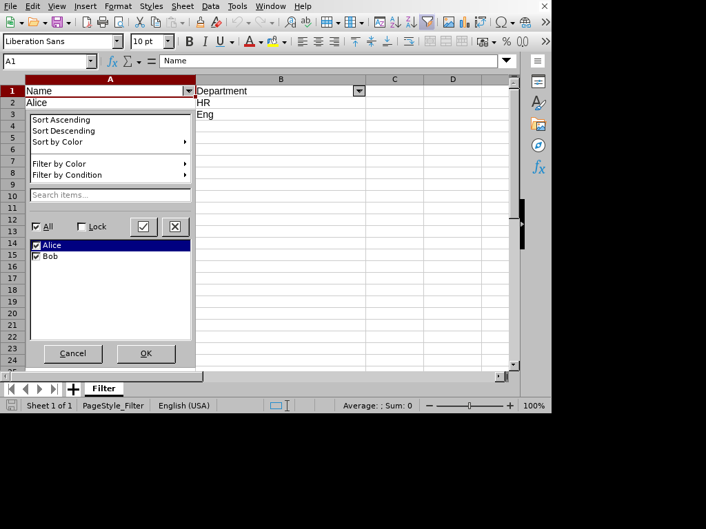</div>

### DSL Code

```ruby
# frozen_string_literal: true

require "xlsxrb"
output_path = ARGV[0] || "interactive_autofilter.xlsx"
Xlsxrb.generate(output_path) do |w|
  w.sheet("Filter") do |s|
    s.column(0, width: 25)
    s.column(1, width: 25)
    s.row(%w[Name Department])
    s.row(%w[Alice HR])
    s.row(%w[Bob Eng])
    s.auto_filter("A1:B3")
  end
  w.defined_name("_xlnm._FilterDatabase", "Filter!$A$1:$B$3", sheet: "Filter", hidden: true)
end

# 2. Read the generated sheet and print cell values
puts "=== Read Validation ==="
workbook = Xlsxrb.read(output_path)
sheet = workbook.sheets.first
sheet.rows.first(5).each do |row|
  row_cells = row.cells.map { |c| "#{c.ref}: #{c.value.inspect}" }
  puts "Row #{row.index}: #{row_cells.join(", ")}"
end
```

### Console Output

```text
=== Read Validation ===
Row 0: A1: "Name", B1: "Department"
Row 1: A2: "Alice", B2: "HR"
Row 2: A3: "Bob", B3: "Eng"
```

<hr/>

## Interactive Comments

[Download .xlsx](files/interactive_comments.xlsx)

> [!TIP]
> **Interactive Feature**: This example uses interactive Excel behaviors (such as validation dropdowns, comments, or autofilters). Since the static visual preview below represents a printed page layout, please **[Download the .xlsx file](files/interactive_comments.xlsx)** and open it in Microsoft Excel, LibreOffice Calc, or Apple Numbers to interact with it!

Demonstrates cell pop-up comments. Open the sheet in Excel and hover your mouse over the cell with the red triangle to view the comment.

### Rendered Output (LibreOffice Calc)

<div></div>

<div>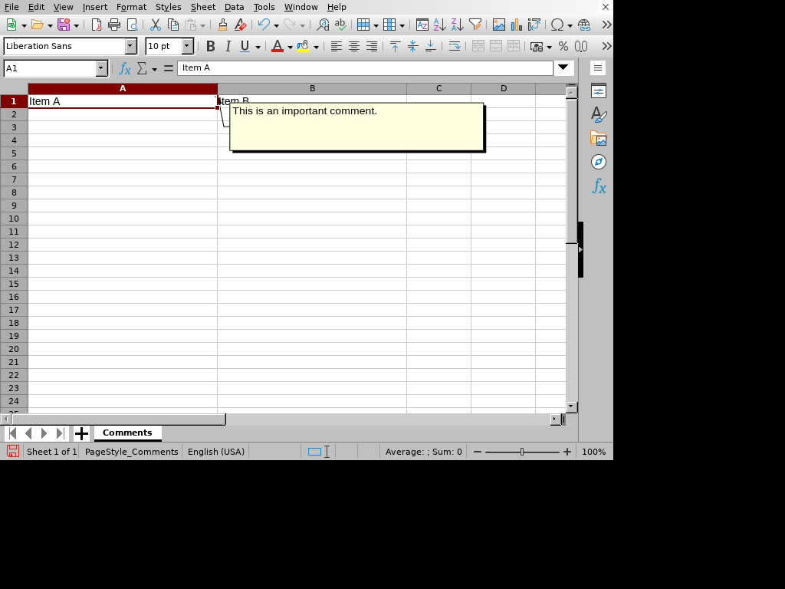</div>

### DSL Code

```ruby
# frozen_string_literal: true

require "xlsxrb"
output_path = ARGV[0] || "interactive_comments.xlsx"
Xlsxrb.generate(output_path) do |w|
  w.sheet("Comments") do |s|
    s.column(0, width: 25)
    s.column(1, width: 25)
    s.row(["Item A", "Item B"])
    s.comment("A1", "This is an important comment.", author: "System")
  end
end

# 2. Read the generated sheet and print cell values
puts "=== Read Validation ==="
workbook = Xlsxrb.read(output_path)
sheet = workbook.sheets.first
sheet.rows.first(5).each do |row|
  row_cells = row.cells.map { |c| "#{c.ref}: #{c.value.inspect}" }
  puts "Row #{row.index}: #{row_cells.join(", ")}"
end
```

### Console Output

```text
=== Read Validation ===
Row 0: A1: "Item A", B1: "Item B"
```

<hr/>

## Interactive Validation Custom

[Download .xlsx](files/interactive_validation_custom.xlsx)

> [!TIP]
> **Interactive Feature**: This example uses interactive Excel behaviors (such as validation dropdowns, comments, or autofilters). Since the static visual preview below represents a printed page layout, please **[Download the .xlsx file](files/interactive_validation_custom.xlsx)** and open it in Microsoft Excel, LibreOffice Calc, or Apple Numbers to interact with it!

Demonstrates interactive custom formula validation rules.

### Rendered Output (LibreOffice Calc)

<div></div>

<div>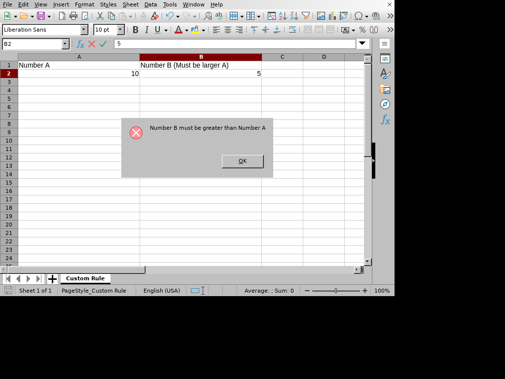</div>

### DSL Code

```ruby
# frozen_string_literal: true

require "xlsxrb"
output_path = ARGV[0] || "interactive_validation_custom.xlsx"
Xlsxrb.generate(output_path) do |w|
  w.sheet("Custom Rule") do |s|
    s.column(0, width: 25)
    s.column(1, width: 25)
    s.row(["Number A", "Number B (Must be larger A)"])
    s.row([10, ""])
    s.validate_data("B2", type: "custom", formula1: "B2>A2", show_error_message: true, error_title: "Validation Error", error: "Number B must be greater than Number A")
  end
end

# 2. Read the generated sheet and print data validations
puts "=== Read Validation ==="
reader = Xlsxrb::Ooxml::Reader.new(output_path)
workbook = Xlsxrb.read(output_path)
sheet = workbook.sheets.first
validations = reader.data_validations(sheet: sheet.name)
validations.each do |v|
  puts "Validation range #{v[:sqref]}: type=#{v[:type]}, formula1=#{v[:formula1]}, formula2=#{v[:formula2]}"
end
```

### Console Output

```text
=== Read Validation ===
Validation range B2: type=custom, formula1=B2>A2, formula2=
```

<hr/>

## Interactive Validation Date

[Download .xlsx](files/interactive_validation_date.xlsx)

> [!TIP]
> **Interactive Feature**: This example uses interactive Excel behaviors (such as validation dropdowns, comments, or autofilters). Since the static visual preview below represents a printed page layout, please **[Download the .xlsx file](files/interactive_validation_date.xlsx)** and open it in Microsoft Excel, LibreOffice Calc, or Apple Numbers to interact with it!

Demonstrates interactive date range constraints validation rules.

### Rendered Output (LibreOffice Calc)

<div></div>

<div>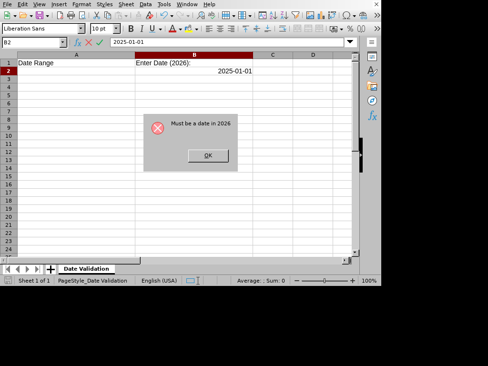</div>

### DSL Code

```ruby
# frozen_string_literal: true

require "xlsxrb"
output_path = ARGV[0] || "interactive_validation_date.xlsx"
Xlsxrb.generate(output_path) do |w|
  w.sheet("Date Validation") do |s|
    s.column(0, width: 25)
    s.column(1, width: 25)
    s.row(["Date Range", "Enter Date (2026):"])
    s.validate_data("B2", type: "date", operator: "between", formula1: "Date(2026,1,1)", formula2: "Date(2026,12,31)", show_error_message: true, error_title: "Invalid Date", error: "Must be a date in 2026")
  end
end

# 2. Read the generated sheet and print data validations
puts "=== Read Validation ==="
reader = Xlsxrb::Ooxml::Reader.new(output_path)
workbook = Xlsxrb.read(output_path)
sheet = workbook.sheets.first
validations = reader.data_validations(sheet: sheet.name)
validations.each do |v|
  puts "Validation range #{v[:sqref]}: type=#{v[:type]}, formula1=#{v[:formula1]}, formula2=#{v[:formula2]}"
end
```

### Console Output

```text
=== Read Validation ===
Validation range B2: type=date, formula1=Date(2026,1,1), formula2=Date(2026,12,31)
```

<hr/>

## Interactive Validation List

[Download .xlsx](files/interactive_validation_list.xlsx)

> [!TIP]
> **Interactive Feature**: This example uses interactive Excel behaviors (such as validation dropdowns, comments, or autofilters). Since the static visual preview below represents a printed page layout, please **[Download the .xlsx file](files/interactive_validation_list.xlsx)** and open it in Microsoft Excel, LibreOffice Calc, or Apple Numbers to interact with it!

Demonstrates dropdown list data validations. Open the sheet in Excel and select cell A1/A2 to see the dropdown list in action.

### Rendered Output (LibreOffice Calc)

<div></div>

<div>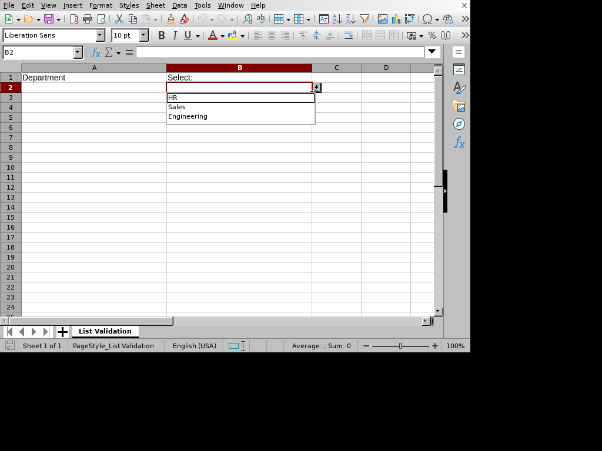</div>

### DSL Code

```ruby
# frozen_string_literal: true

require "xlsxrb"
output_path = ARGV[0] || "interactive_validation_list.xlsx"
Xlsxrb.generate(output_path) do |w|
  w.sheet("List Validation") do |s|
    s.column(0, width: 25)
    s.column(1, width: 25)
    s.row(["Department", "Select:"])
    s.validate_data("B2", in: %w[HR Sales Engineering])
  end
end

# 2. Read the generated sheet and print data validations
puts "=== Read Validation ==="
reader = Xlsxrb::Ooxml::Reader.new(output_path)
workbook = Xlsxrb.read(output_path)
sheet = workbook.sheets.first
validations = reader.data_validations(sheet: sheet.name)
validations.each do |v|
  puts "Validation range #{v[:sqref]}: type=#{v[:type]}, formula1=#{v[:formula1]}, formula2=#{v[:formula2]}"
end
```

### Console Output

```text
=== Read Validation ===
Validation range B2: type=list, formula1="HR,Sales,Engineering", formula2=
```

<hr/>

## Interactive Validation Range

[Download .xlsx](files/interactive_validation_range.xlsx)

> [!TIP]
> **Interactive Feature**: This example uses interactive Excel behaviors (such as validation dropdowns, comments, or autofilters). Since the static visual preview below represents a printed page layout, please **[Download the .xlsx file](files/interactive_validation_range.xlsx)** and open it in Microsoft Excel, LibreOffice Calc, or Apple Numbers to interact with it!

Demonstrates range constraints for whole number validations. Open the sheet in Excel and try entering a value outside 10-100 to trigger the warning.

### Rendered Output (LibreOffice Calc)

<div></div>

<div></div>

### DSL Code

```ruby
# frozen_string_literal: true

require "xlsxrb"
output_path = ARGV[0] || "interactive_validation_range.xlsx"
Xlsxrb.generate(output_path) do |w|
  w.sheet("Range Validation") do |s|
    s.column(0, width: 25)
    s.column(1, width: 25)
    s.row(["Age", "Enter (18-99):"])
    s.validate_data("B2", type: "whole", operator: "between", formula1: "18", formula2: "99", show_error_message: true, error_title: "Invalid Age", error: "Age must be between 18 and 99!")
  end
end

# 2. Read the generated sheet and print data validations
puts "=== Read Validation ==="
reader = Xlsxrb::Ooxml::Reader.new(output_path)
workbook = Xlsxrb.read(output_path)
sheet = workbook.sheets.first
validations = reader.data_validations(sheet: sheet.name)
validations.each do |v|
  puts "Validation range #{v[:sqref]}: type=#{v[:type]}, formula1=#{v[:formula1]}, formula2=#{v[:formula2]}"
end
```

### Console Output

```text
=== Read Validation ===
Validation range B2: type=whole, formula1=18, formula2=99
```

<hr/>

## Interactive Validation Text Length

[Download .xlsx](files/interactive_validation_text_length.xlsx)

> [!TIP]
> **Interactive Feature**: This example uses interactive Excel behaviors (such as validation dropdowns, comments, or autofilters). Since the static visual preview below represents a printed page layout, please **[Download the .xlsx file](files/interactive_validation_text_length.xlsx)** and open it in Microsoft Excel, LibreOffice Calc, or Apple Numbers to interact with it!

Demonstrates interactive text length validation rules.

### Rendered Output (LibreOffice Calc)

<div></div>

<div>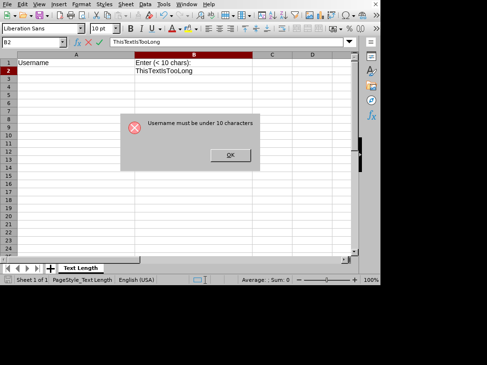</div>

### DSL Code

```ruby
# frozen_string_literal: true

require "xlsxrb"
output_path = ARGV[0] || "interactive_validation_text_length.xlsx"
Xlsxrb.generate(output_path) do |w|
  w.sheet("Text Length") do |s|
    s.column(0, width: 25)
    s.column(1, width: 25)
    s.row(["Username", "Enter (< 10 chars):"])
    s.validate_data("B2", type: "textLength", operator: "lessThan", formula1: "10", show_error_message: true, error_title: "Too Long", error: "Username must be under 10 characters")
  end
end

# 2. Read the generated sheet and print data validations
puts "=== Read Validation ==="
reader = Xlsxrb::Ooxml::Reader.new(output_path)
workbook = Xlsxrb.read(output_path)
sheet = workbook.sheets.first
validations = reader.data_validations(sheet: sheet.name)
validations.each do |v|
  puts "Validation range #{v[:sqref]}: type=#{v[:type]}, formula1=#{v[:formula1]}, formula2=#{v[:formula2]}"
end
```

### Console Output

```text
=== Read Validation ===
Validation range B2: type=textLength, formula1=10, formula2=
```

<hr/>

## Interactive Validation Time

[Download .xlsx](files/interactive_validation_time.xlsx)

> [!TIP]
> **Interactive Feature**: This example uses interactive Excel behaviors (such as validation dropdowns, comments, or autofilters). Since the static visual preview below represents a printed page layout, please **[Download the .xlsx file](files/interactive_validation_time.xlsx)** and open it in Microsoft Excel, LibreOffice Calc, or Apple Numbers to interact with it!

Demonstrates interactive time validation rules.

### Rendered Output (LibreOffice Calc)

<div></div>

<div></div>

### DSL Code

```ruby
# frozen_string_literal: true

require "xlsxrb"
output_path = ARGV[0] || "interactive_validation_time.xlsx"
Xlsxrb.generate(output_path) do |w|
  w.sheet("Time Validation") do |s|
    s.column(0, width: 25)
    s.column(1, width: 25)
    s.row(["Schedule", "Enter Time (after 08:00):"])
    s.validate_data("B2", type: "time", operator: "greaterThan", formula1: "0.33333", show_error_message: true, error_title: "Too Early", error: "Time must be after 08:00 AM")
  end
end

# 2. Read the generated sheet and print data validations
puts "=== Read Validation ==="
reader = Xlsxrb::Ooxml::Reader.new(output_path)
workbook = Xlsxrb.read(output_path)
sheet = workbook.sheets.first
validations = reader.data_validations(sheet: sheet.name)
validations.each do |v|
  puts "Validation range #{v[:sqref]}: type=#{v[:type]}, formula1=#{v[:formula1]}, formula2=#{v[:formula2]}"
end
```

### Console Output

```text
=== Read Validation ===
Validation range B2: type=time, formula1=0.33333, formula2=
```

<hr/>

## Japanese Text

[Download .xlsx](files/japanese_text.xlsx)

Demonstrates writing multi-byte Japanese text and setting appropriate Japanese font names (e.g., Noto Sans CJK JP).

### Rendered Output (LibreOffice Calc)

<div></div>

### DSL Code

```ruby
# frozen_string_literal: true

require "xlsxrb"

output_path = ARGV[0] || "japanese_text.xlsx"

Xlsxrb.generate(output_path) do |w|
  w.style("ja_font") do |style|
    style.font_name("Noto Sans CJK JP").size(12)
  end

  w.sheet("Japanese") do |s|
    s.column(0, width: 25)
    s.column(1, width: 25)
    s.row(%w[日本語ラベル 値], styles: { 0 => "ja_font", 1 => "ja_font" })
    s.row(["売上", 12_500], styles: { 0 => "ja_font" })
  end
end

# 2. Read the generated sheet and print parsed cell values and Ruby classes
puts "=== Read Validation ==="
workbook = Xlsxrb.read(output_path)
sheet = workbook.sheets.first
sheet.rows.each do |row|
  row_cells = row.cells.map do |c|
    "#{c.ref}: #{c.value.inspect} (#{c.value.class})"
  end
  puts "Row #{row.index}: #{row_cells.join(", ")}"
end
```

### Console Output

```text
=== Read Validation ===
Row 0: A1: "日本語ラベル" (String), B1: "値" (String)
Row 1: A2: "売上" (String), B2: 12500 (Integer)
```

<hr/>

## Merge Freeze

[Download .xlsx](files/merge_freeze.xlsx)

Demonstrates merging a cell range into a single cell, and freezing the top rows of a sheet.

### Rendered Output (LibreOffice Calc)

<div></div>

### DSL Code

```ruby
# frozen_string_literal: true

require "xlsxrb"

output_path = ARGV[0] || "merge_freeze.xlsx"

Xlsxrb.generate(output_path) do |w|
  w.style("title") { |style| style.border_all(style: "thin", color: "FF000000").align_horizontal("center") }
  w.style("border") { |style| style.border_all(style: "thin", color: "FF000000") }
  w.sheet("Merge & Freeze") do |s|
    s.sheet_properties(:fit_to_page, true)
    s.page_setup(fit_to_width: 1, fit_to_height: 1)
    s.column(0, width: 25)
    s.column(1, width: 25)
    s.column(2, width: 25)
    s.row(["Merged Title Row", nil, nil], styles: %w[title title title])
    s.row(["Header A", "Header B", "Header C"], styles: %w[border border border])
    s.row(["Row 1 Col A", "Row 1 Col B", "Row 1 Col C"], styles: %w[border border border])
    s.row(["Row 2 Col A", "Row 2 Col B", "Row 2 Col C"], styles: %w[border border border])

    s.merge("A1:C1")
    s.freeze_pane(row: 2, col: 0)
  end
end

# 2. Read the generated sheet and print cell values
puts "=== Read Validation ==="
workbook = Xlsxrb.read(output_path)
sheet = workbook.sheets.first
sheet.rows.first(5).each do |row|
  row_cells = row.cells.map { |c| "#{c.ref}: #{c.value.inspect}" }
  puts "Row #{row.index}: #{row_cells.join(", ")}"
end
```

### Console Output

```text
=== Read Validation ===
Row 0: A1: "Merged Title Row", B1: nil, C1: nil
Row 1: A2: "Header A", B2: "Header B", C2: "Header C"
Row 2: A3: "Row 1 Col A", B3: "Row 1 Col B", C3: "Row 1 Col C"
Row 3: A4: "Row 2 Col A", B4: "Row 2 Col B", C4: "Row 2 Col C"
```

<hr/>

## Page Grid Lines Print

[Download .xlsx](files/page_grid_lines_print.xlsx)

Demonstrates enabling printing of grid lines.

### Rendered Output (LibreOffice Calc)

<div></div>

### DSL Code

```ruby
# frozen_string_literal: true

require "xlsxrb"
output_path = ARGV[0] || "page_grid_lines_print.xlsx"
Xlsxrb.generate(output_path) do |w|
  w.sheet("Print Grid Lines") do |s|
    s.column(0, width: 25)
    s.column(1, width: 25)
    s.print_options(:grid_lines, true)
    s.row(["Grid Lines Printed sheet"])
  end
end

# 2. Read the generated sheet and print page setup properties
puts "=== Read Validation ==="
reader = Xlsxrb::Ooxml::Reader.new(output_path)
workbook = Xlsxrb.read(output_path)
sheet = workbook.sheets.first
margins = reader.page_margins(sheet: sheet.name)
setup = reader.page_setup(sheet: sheet.name)
opts = reader.print_options(sheet: sheet.name)
puts "Page Margins: #{margins.inspect}"
puts "Page Setup: #{setup.inspect}"
puts "Print Options: #{opts.inspect}"
```

### Console Output

```text
=== Read Validation ===
Page Margins: nil
Page Setup: {}
Print Options: {grid_lines: true}
```

<hr/>

## Page Header Footer

[Download .xlsx](files/page_header_footer.xlsx)

Demonstrates setting odd page headers and footers.

### Rendered Output (LibreOffice Calc)

<div></div>

### DSL Code

```ruby
# frozen_string_literal: true

require "xlsxrb"
output_path = ARGV[0] || "page_header_footer.xlsx"
Xlsxrb.generate(output_path) do |w|
  w.sheet("Header Footer") do |s|
    s.column(0, width: 25)
    s.column(1, width: 25)
    s.header_footer(odd_header: "&LMy Company&RPage &P", odd_footer: "&CConfidential")
    s.row(["Header Footer sheet"])
  end
end

# 2. Read the generated sheet and print page setup properties
puts "=== Read Validation ==="
reader = Xlsxrb::Ooxml::Reader.new(output_path)
workbook = Xlsxrb.read(output_path)
sheet = workbook.sheets.first
margins = reader.page_margins(sheet: sheet.name)
setup = reader.page_setup(sheet: sheet.name)
opts = reader.print_options(sheet: sheet.name)
puts "Page Margins: #{margins.inspect}"
puts "Page Setup: #{setup.inspect}"
puts "Print Options: #{opts.inspect}"
```

### Console Output

```text
=== Read Validation ===
Page Margins: nil
Page Setup: {}
Print Options: {}
```

<hr/>

## Page Headings Print

[Download .xlsx](files/page_headings_print.xlsx)

Demonstrates enabling printing of row and column headings.

### Rendered Output (LibreOffice Calc)

<div></div>

### DSL Code

```ruby
# frozen_string_literal: true

require "xlsxrb"
output_path = ARGV[0] || "page_headings_print.xlsx"
Xlsxrb.generate(output_path) do |w|
  w.sheet("Print Headings") do |s|
    s.column(0, width: 25)
    s.column(1, width: 25)
    s.print_options(:headings, true)
    s.row(["Row/Col Headings Printed sheet"])
  end
end

# 2. Read the generated sheet and print page setup properties
puts "=== Read Validation ==="
reader = Xlsxrb::Ooxml::Reader.new(output_path)
workbook = Xlsxrb.read(output_path)
sheet = workbook.sheets.first
margins = reader.page_margins(sheet: sheet.name)
setup = reader.page_setup(sheet: sheet.name)
opts = reader.print_options(sheet: sheet.name)
puts "Page Margins: #{margins.inspect}"
puts "Page Setup: #{setup.inspect}"
puts "Print Options: #{opts.inspect}"
```

### Console Output

```text
=== Read Validation ===
Page Margins: nil
Page Setup: {}
Print Options: {headings: true}
```

<hr/>

## Page Margins Narrow

[Download .xlsx](files/page_margins_narrow.xlsx)

Demonstrates setting narrow page margins.

### Rendered Output (LibreOffice Calc)

<div></div>

### DSL Code

```ruby
# frozen_string_literal: true

require "xlsxrb"
output_path = ARGV[0] || "page_margins_narrow.xlsx"
Xlsxrb.generate(output_path) do |w|
  w.sheet("Narrow Margins") do |s|
    s.column(0, width: 25)
    s.column(1, width: 25)
    s.page_margins(top: 0.25, bottom: 0.25, left: 0.25, right: 0.25, header: 0.1, footer: 0.1)
    s.row(["Narrow Margins sheet"])
  end
end

# 2. Read the generated sheet and print page setup properties
puts "=== Read Validation ==="
reader = Xlsxrb::Ooxml::Reader.new(output_path)
workbook = Xlsxrb.read(output_path)
sheet = workbook.sheets.first
margins = reader.page_margins(sheet: sheet.name)
setup = reader.page_setup(sheet: sheet.name)
opts = reader.print_options(sheet: sheet.name)
puts "Page Margins: #{margins.inspect}"
puts "Page Setup: #{setup.inspect}"
puts "Print Options: #{opts.inspect}"
```

### Console Output

```text
=== Read Validation ===
Page Margins: {left: 0.25, right: 0.25, top: 0.25, bottom: 0.25, header: 0.1, footer: 0.1}
Page Setup: {}
Print Options: {}
```

<hr/>

## Page Margins Wide

[Download .xlsx](files/page_margins_wide.xlsx)

Demonstrates setting wide page margins.

### Rendered Output (LibreOffice Calc)

<div></div>

### DSL Code

```ruby
# frozen_string_literal: true

require "xlsxrb"
output_path = ARGV[0] || "page_margins_wide.xlsx"
Xlsxrb.generate(output_path) do |w|
  w.sheet("Wide Margins") do |s|
    s.column(0, width: 25)
    s.column(1, width: 25)
    s.page_margins(top: 1.0, bottom: 1.0, left: 1.0, right: 1.0, header: 0.5, footer: 0.5)
    s.row(["Wide Margins sheet"])
  end
end

# 2. Read the generated sheet and print page setup properties
puts "=== Read Validation ==="
reader = Xlsxrb::Ooxml::Reader.new(output_path)
workbook = Xlsxrb.read(output_path)
sheet = workbook.sheets.first
margins = reader.page_margins(sheet: sheet.name)
setup = reader.page_setup(sheet: sheet.name)
opts = reader.print_options(sheet: sheet.name)
puts "Page Margins: #{margins.inspect}"
puts "Page Setup: #{setup.inspect}"
puts "Print Options: #{opts.inspect}"
```

### Console Output

```text
=== Read Validation ===
Page Margins: {left: 1.0, right: 1.0, top: 1.0, bottom: 1.0, header: 0.5, footer: 0.5}
Page Setup: {}
Print Options: {}
```

<hr/>

## Page Orientation Landscape

[Download .xlsx](files/page_orientation_landscape.xlsx)

Demonstrates landscape page setup for printing.

### Rendered Output (LibreOffice Calc)

<div></div>

### DSL Code

```ruby
# frozen_string_literal: true

require "xlsxrb"
output_path = ARGV[0] || "page_orientation_landscape.xlsx"
Xlsxrb.generate(output_path) do |w|
  w.sheet("Landscape") do |s|
    s.column(0, width: 25)
    s.column(1, width: 25)
    s.page_setup(orientation: :landscape)
    s.row(["Landscape Orientation sheet"])
  end
end

# 2. Read the generated sheet and print page setup properties
puts "=== Read Validation ==="
reader = Xlsxrb::Ooxml::Reader.new(output_path)
workbook = Xlsxrb.read(output_path)
sheet = workbook.sheets.first
margins = reader.page_margins(sheet: sheet.name)
setup = reader.page_setup(sheet: sheet.name)
opts = reader.print_options(sheet: sheet.name)
puts "Page Margins: #{margins.inspect}"
puts "Page Setup: #{setup.inspect}"
puts "Print Options: #{opts.inspect}"
```

### Console Output

```text
=== Read Validation ===
Page Margins: nil
Page Setup: {orientation: "landscape"}
Print Options: {}
```

<hr/>

## Page Paper Size A3

[Download .xlsx](files/page_paper_size_a3.xlsx)

Demonstrates setting paper size to A3 (paper size 8).

### Rendered Output (LibreOffice Calc)

<div></div>

### DSL Code

```ruby
# frozen_string_literal: true

require "xlsxrb"
output_path = ARGV[0] || "page_paper_size_a3.xlsx"
Xlsxrb.generate(output_path) do |w|
  w.sheet("A3 Sheet") do |s|
    s.column(0, width: 25)
    s.column(1, width: 25)
    s.page_setup(paper_size: 8) # ISO A3 is paperSize="8"
    s.row(["ISO A3 Paper Size sheet"])
  end
end

# 2. Read the generated sheet and print page setup properties
puts "=== Read Validation ==="
reader = Xlsxrb::Ooxml::Reader.new(output_path)
workbook = Xlsxrb.read(output_path)
sheet = workbook.sheets.first
margins = reader.page_margins(sheet: sheet.name)
setup = reader.page_setup(sheet: sheet.name)
opts = reader.print_options(sheet: sheet.name)
puts "Page Margins: #{margins.inspect}"
puts "Page Setup: #{setup.inspect}"
puts "Print Options: #{opts.inspect}"
```

### Console Output

```text
=== Read Validation ===
Page Margins: nil
Page Setup: {paper_size: 8}
Print Options: {}
```

<hr/>

## Row Grouping

[Download .xlsx](files/row_grouping.xlsx)

Demonstrates outline grouping for rows.

### Rendered Output (LibreOffice Calc)

<div></div>

### DSL Code

```ruby
# frozen_string_literal: true

require "xlsxrb"
output_path = ARGV[0] || "row_grouping.xlsx"
Xlsxrb.generate(output_path) do |w|
  w.style("parent") { |style| style.border_all(style: "thin", color: "FF000000").bold }
  w.style("child") { |style| style.border_all(style: "thin", color: "FF000000").align_horizontal("left").indent(2) }
  w.sheet("Row Grouping") do |s|
    s.column(0, width: 25)
    s.column(1, width: 25)
    s.row(["Parent Row 1", ""], styles: %w[parent parent])
    s.row(["Child Row 1.1", ""], outline_level: 1, styles: %w[child child])
    s.row(["Child Row 1.2", ""], outline_level: 1, styles: %w[child child])
  end
end

# 2. Read the generated sheet and print row attributes
puts "=== Read Validation ==="
workbook = Xlsxrb.read(output_path)
sheet = workbook.sheets.first
sheet.rows.each do |row|
  puts "Row #{row.index}: height=#{row.height}, hidden=#{row.hidden}, outline_level=#{row.outline_level}"
end
```

### Console Output

```text
=== Read Validation ===
Row 0: height=, hidden=false, outline_level=
Row 1: height=, hidden=false, outline_level=1
Row 2: height=, hidden=false, outline_level=1
```

<hr/>

## Row Height Tall

[Download .xlsx](files/row_height_tall.xlsx)

Demonstrates setting very tall row heights.

### Rendered Output (LibreOffice Calc)

<div></div>

### DSL Code

```ruby
# frozen_string_literal: true

require "xlsxrb"
output_path = ARGV[0] || "row_height_tall.xlsx"
Xlsxrb.generate(output_path) do |w|
  w.style("border") { |style| style.border_all(style: "thin", color: "FF000000") }
  w.sheet("Row Height") do |s|
    s.column(0, width: 25)
    s.column(1, width: 25)
    s.row(["Very Tall Row (Height 60)", ""], height: 60, styles: %w[border border])
    s.row(["Normal Row", ""], styles: %w[border border])
  end
end

# 2. Read the generated sheet and print row attributes
puts "=== Read Validation ==="
workbook = Xlsxrb.read(output_path)
sheet = workbook.sheets.first
sheet.rows.each do |row|
  puts "Row #{row.index}: height=#{row.height}, hidden=#{row.hidden}, outline_level=#{row.outline_level}"
end
```

### Console Output

```text
=== Read Validation ===
Row 0: height=60.0, hidden=false, outline_level=
Row 1: height=, hidden=false, outline_level=
```

<hr/>

## Row Heights

[Download .xlsx](files/row_heights.xlsx)

Demonstrates setting custom row heights.

### Rendered Output (LibreOffice Calc)

<div></div>

### DSL Code

```ruby
# frozen_string_literal: true

require "xlsxrb"
output_path = ARGV[0] || "row_heights.xlsx"
Xlsxrb.generate(output_path) do |w|
  w.style("border") { |style| style.border_all(style: "thin", color: "FF000000") }
  w.sheet("Heights") do |s|
    s.column(0, width: 25)
    s.column(1, width: 25)
    s.row(["Normal Row", ""], styles: %w[border border])
    s.row(["Tall Row", ""], height: 40, styles: %w[border border])
  end
end

# 2. Read the generated sheet and print row attributes
puts "=== Read Validation ==="
workbook = Xlsxrb.read(output_path)
sheet = workbook.sheets.first
sheet.rows.each do |row|
  puts "Row #{row.index}: height=#{row.height}, hidden=#{row.hidden}, outline_level=#{row.outline_level}"
end
```

### Console Output

```text
=== Read Validation ===
Row 0: height=, hidden=false, outline_level=
Row 1: height=40.0, hidden=false, outline_level=
```

<hr/>

## Sheet Tab Colors

[Download .xlsx](files/sheet_tab_colors.xlsx)

Demonstrates customizing tab colors of individual worksheets.

### Rendered Output (LibreOffice Calc)

<div></div>

<div></div>

<div>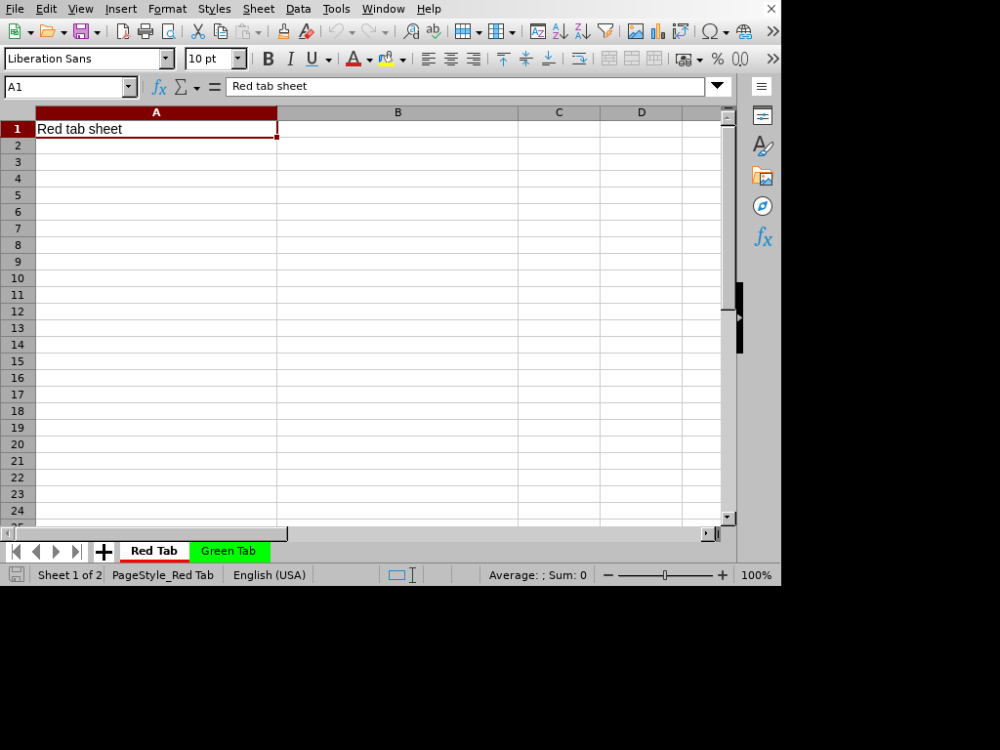</div>

### DSL Code

```ruby
# frozen_string_literal: true

require "xlsxrb"
output_path = ARGV[0] || "sheet_tab_colors.xlsx"
Xlsxrb.generate(output_path) do |w|
  w.sheet("Red Tab") do |s|
    s.column(0, width: 25)
    s.column(1, width: 25)
    s.sheet_properties(:tab_color, :red)
    s.row(["Red tab sheet"])
  end
  w.sheet("Green Tab") do |s|
    s.sheet_properties(:tab_color, :green)
    s.row(["Green tab sheet"])
  end
end

# 2. Read the generated sheet and print sheet properties
puts "=== Read Validation ==="
reader = Xlsxrb::Ooxml::Reader.new(output_path)
workbook = Xlsxrb.read(output_path)
workbook.sheet_names.each do |s_name|
  props = reader.sheet_properties(sheet: s_name)
  puts "Sheet: #{s_name}, tab color: #{props[:tab_color].inspect}"
end
```

### Console Output

```text
=== Read Validation ===
Sheet: Red Tab, tab color: "red"
Sheet: Green Tab, tab color: "green"
```

<hr/>

## Sparkline Column

[Download .xlsx](files/sparkline_column.xlsx)

Demonstrates embedded column sparklines in cell ranges.

### Rendered Output (LibreOffice Calc)

<div></div>

### DSL Code

```ruby
# frozen_string_literal: true

require "xlsxrb"
output_path = ARGV[0] || "sparkline_column.xlsx"
Xlsxrb.generate(output_path) do |w|
  w.sheet("Sparkline") do |s|
    s.sheet_properties(:fit_to_page, true)
    s.page_setup(fit_to_width: 1, fit_to_height: 1)
    s.column(0, width: 25)
    s.column(1, width: 25)
    s.row([5, 12, 8, 15, nil])
    s.sparkline_group(
      type: :column,
      sparklines: [{ location_ref: "E1", data_ref: "Sparkline!A1:D1" }]
    )
  end
end

# 2. Read the generated sheet and print cell values
puts "=== Read Validation ==="
workbook = Xlsxrb.read(output_path)
sheet = workbook.sheets.first
sheet.rows.first(3).each do |row|
  row_cells = row.cells.map { |c| "#{c.ref}: #{c.value.inspect}" }
  puts "Row #{row.index}: #{row_cells.join(", ")}"
end
```

### Console Output

```text
=== Read Validation ===
Row 0: A1: 5, B1: 12, C1: 8, D1: 15
```

<hr/>

## Sparkline Line

[Download .xlsx](files/sparkline_line.xlsx)

Demonstrates embedded line sparklines in cell ranges.

### Rendered Output (LibreOffice Calc)

<div></div>

<div>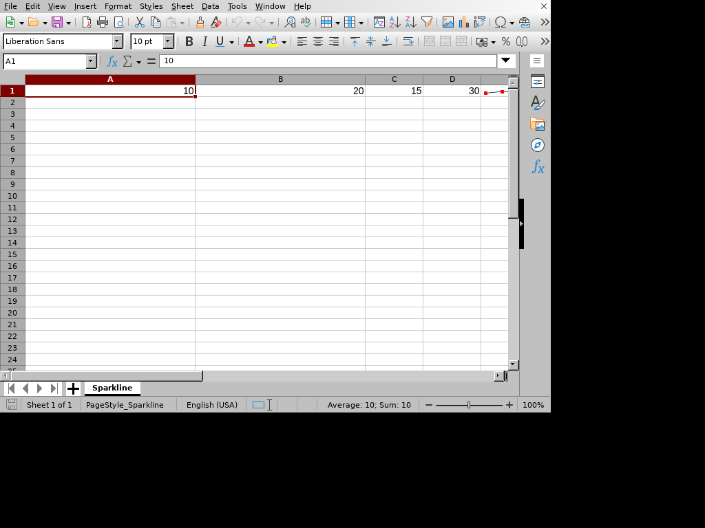</div>

### DSL Code

```ruby
# frozen_string_literal: true

require "xlsxrb"
output_path = ARGV[0] || "sparkline_line.xlsx"
Xlsxrb.generate(output_path) do |w|
  w.sheet("Sparkline") do |s|
    s.sheet_properties(:fit_to_page, true)
    s.page_setup(fit_to_width: 1, fit_to_height: 1)
    s.column(0, width: 25)
    s.column(1, width: 25)
    s.row([10, 20, 15, 30, nil])
    s.sparkline_group(
      type: :line,
      markers: true,
      color_series: "FF000000",
      color_markers: :red,
      sparklines: [{ location_ref: "E1", data_ref: "Sparkline!A1:D1" }]
    )
  end
end

# 2. Read the generated sheet and print cell values
puts "=== Read Validation ==="
workbook = Xlsxrb.read(output_path)
sheet = workbook.sheets.first
sheet.rows.first(3).each do |row|
  row_cells = row.cells.map { |c| "#{c.ref}: #{c.value.inspect}" }
  puts "Row #{row.index}: #{row_cells.join(", ")}"
end
```

<hr/>

## Styles Fonts Fills

[Download .xlsx](files/styles_fonts_fills.xlsx)

Demonstrates cell formatting, including custom font sizing, bold/italic text, custom text colors, and background fill colors.

### Rendered Output (LibreOffice Calc)

<div></div>

### DSL Code

```ruby
# frozen_string_literal: true

require "xlsxrb"

output_path = ARGV[0] || "styles_fonts_fills.xlsx"

Xlsxrb.generate(output_path) do |w|
  w.style("header") do |style|
    style.bold.size(14).font_color("FFFFFFFF").fill_color("FF4F81BD")
  end

  w.style("highlight") do |style|
    style.italic.font_color("FFC00000").fill_color("FFFFFF00")
  end

  w.sheet("Styles") do
    w.column(0, width: 25)
    w.column(1, width: 25)
    w.row(["Header 1", "Header 2"], styles: { 0 => "header", 1 => "header" })
    w.row(["Normal Text", "Highlighted Text"], styles: { 1 => "highlight" })
  end
end

# 2. Read the generated sheet and print styling details
puts "=== Read Validation ==="
workbook = Xlsxrb.read(output_path)
sheet = workbook.sheets.first
sheet.rows.first(4).each do |row|
  row_cells = row.cells.map do |c|
    xf = workbook.styles[:cell_xfs][c.style_index] if c.style_index
    font = xf ? workbook.styles[:fonts][xf[:font_id]] : nil
    fill = xf ? workbook.styles[:fills][xf[:fill_id]] : nil
    "#{c.ref}: #{c.value.inspect} (font=#{font&.[](:name)}, fill=#{fill&.[](:fg_color)&.[](:rgb)})"
  end
  puts "Row #{row.index}: #{row_cells.join(", ")}"
end
```

### Console Output

```text
=== Read Validation ===
Row 0: A1: "Header 1" (font=Calibri, fill=FF4F81BD), B1: "Header 2" (font=Calibri, fill=FF4F81BD)
Row 1: A2: "Normal Text" (font=, fill=), B2: "Highlighted Text" (font=Calibri, fill=FFFFFF00)
```

<hr/>

## View Show Grid Lines

[Download .xlsx](files/view_show_grid_lines.xlsx)

Demonstrates disabling visible grid lines in spreadsheet view.

### Rendered Output (LibreOffice Calc)

<div></div>

<div>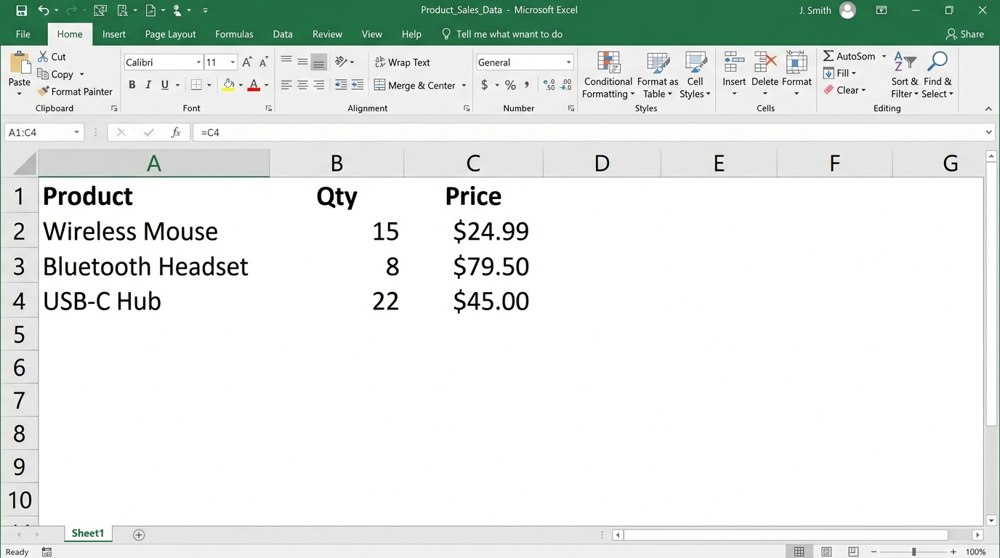</div>

### DSL Code

```ruby
# frozen_string_literal: true

require "xlsxrb"
output_path = ARGV[0] || "view_show_grid_lines.xlsx"
Xlsxrb.generate(output_path) do |w|
  w.sheet("Hide Grid Lines") do |s|
    s.column(0, width: 25)
    s.column(1, width: 25)
    s.sheet_view(:show_grid_lines, false)
    s.row(["No Grid Lines displayed"])
  end
end

# 2. Read the generated sheet and print view configurations
puts "=== Read Validation ==="
reader = Xlsxrb::Ooxml::Reader.new(output_path)
workbook = Xlsxrb.read(output_path)
workbook.sheet_names.each do |s_name|
  view = reader.sheet_view(sheet: s_name)
  puts "Sheet '#{s_name}' views zoom scale: #{view[:zoom_scale]}%, show grid lines: #{view[:show_grid_lines]}"
end
```

### Console Output

```text
=== Read Validation ===
Sheet 'Hide Grid Lines' views zoom scale: %, show grid lines: false
```

<hr/>

## View Zoom Scale

[Download .xlsx](files/view_zoom_scale.xlsx)

Demonstrates setting custom zoom scale in sheet view (e.g. 150%).

### Rendered Output (LibreOffice Calc)

<div></div>

<div>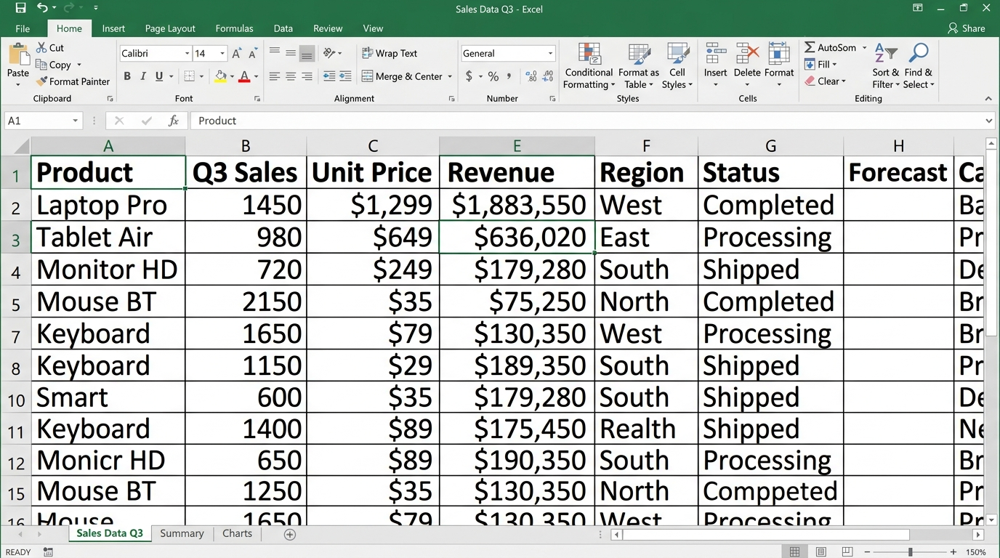</div>

### DSL Code

```ruby
# frozen_string_literal: true

require "xlsxrb"
output_path = ARGV[0] || "view_zoom_scale.xlsx"
Xlsxrb.generate(output_path) do |w|
  w.sheet("Zoom 150") do |s|
    s.column(0, width: 25)
    s.column(1, width: 25)
    s.sheet_view(:zoom_scale, 150)
    s.row(["Zoom scale is set to 150%"])
  end
end

# 2. Read the generated sheet and print view configurations
puts "=== Read Validation ==="
reader = Xlsxrb::Ooxml::Reader.new(output_path)
workbook = Xlsxrb.read(output_path)
workbook.sheet_names.each do |s_name|
  view = reader.sheet_view(sheet: s_name)
  puts "Sheet '#{s_name}' views zoom scale: #{view[:zoom_scale]}%, show grid lines: #{view[:show_grid_lines]}"
end
```

### Console Output

```text
=== Read Validation ===
Sheet 'Zoom 150' views zoom scale: 150%, show grid lines:
```

<hr/>

## Workbook Three Sheets

[Download .xlsx](files/workbook_three_sheets.xlsx)

Demonstrates creating workbooks with multiple worksheets.

### Rendered Output (LibreOffice Calc)

<div></div>

<div></div>

<div></div>

### DSL Code

```ruby
# frozen_string_literal: true

require "xlsxrb"
output_path = ARGV[0] || "workbook_three_sheets.xlsx"
Xlsxrb.generate(output_path) do |w|
  w.sheet("First Sheet") { |s| s.row(["First Sheet Data"]) }
  w.sheet("Second Sheet") { |s| s.row(["Second Sheet Data"]) }
  w.sheet("Third Sheet") { |s| s.row(["Third Sheet Data"]) }
end

# 2. Read the generated sheet and print the sheets structure
puts "=== Read Validation ==="
workbook = Xlsxrb.read(output_path)
puts "Workbook sheets: #{workbook.sheet_names.join(", ")}"
```

### Console Output

```text
=== Read Validation ===
Workbook sheets: First Sheet, Second Sheet, Third Sheet
```

<hr/>

